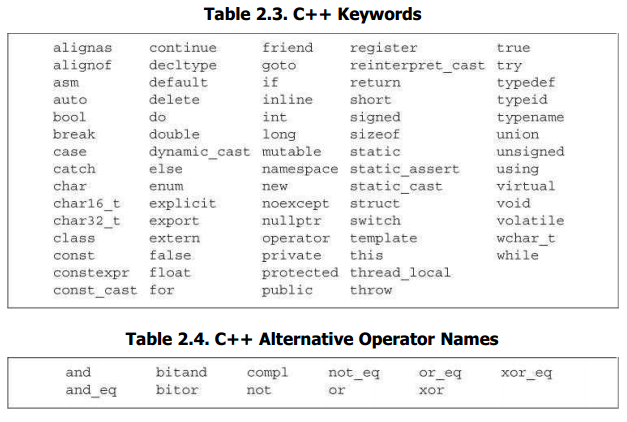

# 变量和基本类型

## 基本内置类型

### 算数类型

算术类型包含两种形式：整数类型（包含字符和布尔类型）和浮点数类型。

内置类型的大小在不同的机器上很可能是不一致的，标准只说明了编译器必须保证的最小尺寸，但是编译器可以提供更大的尺寸，不同的尺寸导致可表示的数字范围不一样。

| 类型          | 含义           | 最小尺寸                       |
| ------------- | -------------- | ------------------------------ |
| `bool`        | 布尔类型       | 8bits                          |
| `char`        | 字符           | 8bits                          |
| `wchar_t`     | 宽字符         | 16bits                         |
| `char16_t`    | Unicode字符    | 16bits                         |
| `char32_t`    | Unicode字符    | 32bits                         |
| `short`       | 短整型         | 16bits                         |
| `int`         | 整型           | 16bits                         |
| `long`        | 长整型         | 32bits                         |
| `long long`   | 长整型         | 64bits （是在C++11中新定义的） |
| `float`       | 单精度浮点数   | 6位有效数字                    |
| `double`      | 双精度浮点数   | 10位有效数字                   |
| `long double` | 扩展精度浮点数 | 10位有效数字                   |

#### 整数类型

- `bool` 类型的取值是 `true `或 `false` 。
- 一个 `char` 的大小和一个机器字节一样，确保可以存放机器基本字符集中任意字符对应的数字值。`wchar_t `确保可以存放机器最大扩展字符集中的任意一个字符。`char16_t` 和 `char32_t` 则用于 Unicode 字符集，它们的长度如类型名中的数字所示。
- 在整型类型大小方面，C++ 规定 `short` ≤ `int` ≤ `long` ≤ `long long`（`long long`是C++11定义的类型）。现代计算机中 `short` 通常为 16 位，`int`  为 32 位，`long`  在 32 位机器上是 32 位，在 64 位机器上是 64 位。

#### 浮点数类型

浮点数类型常用的有两种：单精度 `float` 类型和双精度 `double` 类型还有扩展精度 `long double` 类型。

目前所有现代计算机都遵循 IEEE 754 浮点数标准。`long double` 可能是 96 位或 128 位，通常用于容纳特殊目的的浮点数硬件，且精度在不同实现之间不同。

#### 有符号和无符号类型

目前所有现代计算机都用二进制补码来表示有符号整数类型。带符号类型可以表示正数、负数和0，无符号类型只能表示大于等于0的数值。除去布尔型和扩展字符型（`wchar_t`,` char16_t`, `char32_t`），其他整型可以分为带符号（`signed`）和无符号（`unsigned`）两种。

- 类型 `int`、`short`、`long `和 `long long` 都是带符号的，在类型名前面添加 `unsigned` 可以得到对应的无符号类型，如： `unsigned int`。

- 字符型分为 `char`、`signed char ` 和 `unsigned char `三种，但是表现形式只有带符号和无符号两种。类型`char` 和 `signed char` 并不一样， `char` 的具体形式由编译器（compiler）决定。

#### 决定使用何种内置类型的建议

- 当知道值不可能为负数时用 `unsigned` 类型；
- 在算数运算中使用 `int` 。`short`  的运算速度和容量都不及 `int`，而 `long` 在 32 位机器与 `int` 大小一致。如果值超出 `int` 的最小保证范围，使用 `long long `。
- 在算数表达式中不要使用 `char` 和 `bool` 类型。如果需要使用一个不大的整数，应该明确指定它的类型是 `signed char ` 还是 `unsigned char`。
- 将 `double` 用于浮点运算， `float` 通常精度不够而且 `double` 的运算时间可能还优于 `float` ，`long double` 除非在特殊场景下几乎不会使用到。

### 类型转换

进行类型转换时，类型所能表示的值的范围决定了转换的过程。

- 把非布尔类型的算术值赋给布尔类型时，初始值为0则结果为 `false`，否则结果为 `true`。
- 把布尔值赋给非布尔类型时，初始值为 `false` 则结果为0，初始值为 `true` 则结果为1。
- 把浮点数赋给整数类型时，进行近似处理，结果值仅保留浮点数中的整数部分。
- 把整数值赋给浮点类型时，小数部分记为0。如果该整数所占的空间超过了浮点类型的容量，精度可能有损失。
- 赋给无符号类型一个超出它表示范围的值时，结果是初始值对无符号类型表示数值总数取模后的余数。如：`unsigned char` 的取值范围是 0~255，如果被赋的值大于等于 256 ，则将对 256 取模再赋值，-1 取模为 255。
- 赋给带符号类型一个超出它表示范围的值时，结果是未定义的。

#### 类型转换的详解

##### 整型提升

字符类型、`short` 类型或者枚举在表达式中使用，如果 `int` 可以表示原始值将转为 `int` 值，否则转为 `unsigned int` 值，这个过程称为整型提升。

##### 整型转换

任何一个整数转为指定的无符号类型是对无符号值的最大值加一取模，取模的结果一定是非负数。

当将任何整数转为有符号类型时，如果目的类型可以表示原始值，值将不变，否则结果由编译器实现决定。

##### 整数和浮点数

当将浮点数转为整型时，小数点后的部分将被截断。如果结果值无法被此整型表示，结果是未定义的。特别是将负的浮点数转为无符号整型时，结果未定义。当将整数转为浮点数时，如果值在浮点数的范围内，但没法达到对应的精度时，结果要么是最接近的更大值要么是最接近的更小值。如果值超出了范围，结果是未定义的。

##### 浮点类型

将精度更小的浮点数转为精度更大的浮点数，值不变。将精度更大的浮点数转为精度更小的浮点数，结果遵循整数转为浮点数的规则。

##### 算术转换

所有算术运算符都有可能引起类型转换，结果是将操作数转为一个相同的类型，同时也是结果的类型，这种行为称为算术转换。

- 如果任何一个操作数是 `long double` 时，其它的操作数转为 `long double`;
- 否则，如果一个操作数是 `double` 时，其它的操作数转为 `double`;
- 否则，如果一个操作数是 `float` 时，其它操作数转为 `float`;
- 否则，先执行整型提升，如果一个操作数是 `unsigned long int` 时，其它的类型转为 `unsigned long int`;
- 否则，如果一个操作数是 `long int` 而另一个是 `unsigned int` 时，结果取决于 `long int` 是否能够表示 `unsigned int` 的所有值，如果可以则` unsigned int` 转为 `long int`，否则两者都转为 `unsigned long int`;
- 否则，如果一个操作数是 `long int`，其它的操作数转为 `long int`；
- 否则，操作数都是 `int` 类型。

#### 避免无法预知和依赖于实现环境的行为

##### 无符号数不会小于0这一事实关系到循环的写法

```
for (unsigned u = 10; u >= 0; --u) //@ 当 u 等于0时，--u 的结果将会是4294967295。
    std::cout << u << std::endl;
```

##### 不要混用有符号和无符号类型

当有无符号值参与运算时，通常结果就是无符号值，此时即便在我们的直觉中值应该是负数，数值会被解释为一个很大的无符号值。

```
unsigned u1 = 42, u2 = 10;
std::cout << u1 - u2 << std::endl; //@ 32
std::cout << u2 - u1 << std::endl; //@ 4294967264
```

### 字面值常量

字面量用来描述数字、字符和字符串的值，字面量是常量。每个字面量都有类型，字面量的形式和值决定了其类型。

#### 整型字面值常量

以`0`开头的整数代表八进制（octal）数，以 `0x` 或 `0X` 开头的整数代表十六进制（hexadecimal）数。在 C++14中，`0b` 或 `0B` 开头的整数代表二进制（binary）数。

- 十进制是有符号的，从 `int`, `long` 或 ` long long` 中选择最小可容纳数值的类型。
- 八进制和十六进制可以是无符号或者有符号的，从 `int`, `unsigned`, `long`, `unsigned long`, `long long` 或 `unsigned long long` 中查找适合的类型。

如果数值大于最大的类型的范围则会产生错误。没有 `short` 类型的字面量。

添加特定的后缀或者后缀组合可以改变整型字面值的默认类型：

| 后缀 | 最小类型 |
| :----: | :--------: |
| U 或 u | unsigned |
| L 或 l | long |
| LL或 ll | long long |

以上后缀适用于十进制、八进制和十六进制。如：`0XFUL` 是 `unsigned long` 类型的值 15 ，1234L 则是 `long` 类型的值 1234 。

#### 浮点型字面值常量

浮点型字面值可以使用小数的方式表示，也可以使用科学计数法表示。

浮点型字面值默认是一个 `double`。

添加特定的后缀或者后缀组合可以改变浮点型字面值的默认类型：

| 后缀 | 类型 |
| :----: | :----: |
| f 或 F | float |
| l 或 L | long double |

#### 字符型字面值

字符常量值是一个整数。字符写做单引号中的单个字符如：`'x'`，值是字符在机器字符集中的数字表示值。

C++ 和 C 中定义了几个可以的字符，这些字符通常是不可打印或者在字符串中有特殊含义。

| 字符字面值 | 含义 |
| :----: | :----: |
| `\n`     | 换行符 |
| `\t`     |横向制表符|
| `\a`     |响铃|
| `\v`     |纵向制表符|
| `\b`     |退格符|
| `\"`     |双引号|
| `\\`     |反斜线|
| `\?`     |问号|
| `\'`     |单引号|
| `\r`     |回车符|
| `\f`     |进纸符|

泛化转义序列的形式是 `\x` 后紧跟1个或多个十六进制数字，或者 `\` 后紧跟1个、2个或3个八进制数字，其中数字部分表示字符对应的数值。

如果 `\` 后面跟着的八进制数字超过3个，则只有前3个数字与 `\` 构成转义序列。相反，`\x `要用到后面跟着的所有数字。

添加特定的前缀指定字符型字面值的类型：

| 前缀 |         含义         |   类型   |
| :--: | :------------------: | :------: |
|  u   | Unicode 16 character | char16_t |
|  U   | Unicode 32character  | char32_t |
|  L   |    wide charater     | wchar_t  |

#### 字符串字面值

字符串字面值是双引号中的 0 个或多个字符。

字符串字面量就是字符数组，并且编译器会在字符串的末尾隐式加上一个 `\0` 字符。所以字符串的真正长度比看起来多了一个字符。如：`"A"` 有两个字节。

以上字符型字面值的转义同样适用于字符串字面值。

两个相邻的字符串（中间只有空白符）会在编译期间拼接成一个字符串，通常如果字符串太长时会这么做。

```
cout << "hello" 
	" world"<< endl;   //@ hello world
```

添加特定的前缀指定字符串型字面值的类型：

| 前缀 |         含义         |   类型   |
| :--: | :------------------: | :------: |
|  u   | Unicode 16 character | char16_t |
|  U   | Unicode 32character  | char32_t |
|  L   |    wide charater     | wchar_t  |
|  u8  |        utf-8         |   char   |

#### 其它字面值常量

- `true` 和 `false` 是 `bool` 类型的常量。
- `nullptr` 是指针的常量，在 C 中一般写做 `NULL` 宏。

## 变量

变量提供一个具名的、可供程序操作的存储空间。 C++ 中变量和对象一般可以互换使用。

### 变量定义

变量定义包含类型名和其后的一个或多个变量名，变量名之间用逗号分割，并且以分号结束。

定义可以为一个或多个变量提供初始值。

#### 变量初始化

初始化不是赋值。初始化发生在变量创建时给定一个值，而赋值是将对象原有的值擦除并替换成新值。

##### 列表初始化

用花括号初始化变量称为列表初始化。当用于内置类型的变量时，如果使用了列表初始化并且初始值存在丢失信息的风险，则编译器会报错。

```
long double ld = 3.1415926536;
int a{ ld };  		//@ error
int b = { ld };   	//@ error
int c(ld);   	//@ ok
int d = ld; 	//@ ok
```

##### 默认初始化

如果定义变量时未指定初值，则变量被默认初始化。

- 对于内置类型，定义于任何函数体之外的变量被初始化为0。
- 定义于函数体内的内置类型对象如果没有初始化，则其值未定义，使用该类值是一种错误的编程行为且很难调试。
- 类的对象如果没有显式初始化，则其值由类确定。

建议初始化每一个内置类型的变量。

### 变量声明和定义的关系

C++ 沿用了 C 的分离编译方式，分离编译允许我们将程序拆分成多个源文件，而且可以单独编译，最后再将所有的编译出来的 `.o  `文件链接在一起。为了支持分离式编译，C++ 将声明和定义区分开：

- 声明使得名字为程序所知。一个文件如果想使用其他地方定义的名字，则必须先包含对那个名字的声明。

- 定义负责创建与名字相关联的实体。

如果想声明一个变量而不定义它，就在变量名前添加关键字 `extern`，并且不要显式地初始化变量。`extern`语句如果包含了初始值就不再是声明了，而变成了定义。

变量能且只能被定义一次，但是可以被声明多次。如果要在多个文件中使用同一个变量，就必须将声明和定义分开。此时变量的定义必须出现且只能出现在一个文件中，其他使用该变量的文件必须对其进行声明，但绝对不能重复定义。

### 标识符

- C++的标识符由字母、数字和下划线组成，其中必须以字母或下划线开头。
- 标识符的长度没有限制，但是对大小写字母敏感。
- C++为标准库保留了一些名字，不能使用这些保留字作标识符。
- 用户自定义的标识符最好不要连续出现两个下划线，也不要以下划线紧连大写字母开头。
- 定义在函数体外的标识符最好不要以下划线开头。

C++ 关键字和 C++ 操作符替代名：



### 作用域

C++ 中的作用域用大括号 `{}` 来分割，名字从定义的位置直到声明它的作用域结束的位置都是可见的。相同的名字可以在不同的作用域中指代不同的实体。

C++ 中有多种级别的作用域：

- 在任何其它作用域之外定义的名字具有 `global` 作用域，全局作用域中的名字可以在任何地方访问。
- 定义在类中的名字具有 `class` 作用域。
- 定义在名称空间中的名字具有 `namespace` 作用域。
- 定义在块中的名字具有 `block` 作用域。

最好将变量尽量定义在靠近第一次使用的位置

- 这样可以变量容易找到，从而提高程序的可读性。
- 更为重要的是在靠近使用的地方定义将更容易将变量初始化为有用的值。

作用域是可以嵌套的：

- 一旦名字被定义在外部作用域中，就可以被接下来的内部作用域访问。同时内部作用域中定义的相同名字会遮蔽外部作用域的名字。
- 可以用作用域操作符 `::` 来覆盖默认的作用域规则。因为全局作用域本身并没有名字，所以当作用域操作符的左侧为空时表示全局作用域。

## 复合类型

复合类型指的是用别的类型定义的类型。

### 引用

引用为对象起了另外一个名字，引用类型引用另外一种类型。

- 定义引用时，程序把引用和它的初始值绑定在一起，而不是将初始值拷贝给引用。一旦初始化完成，将无法再令引用重新绑定到另一个对象，因此引用必须初始化。

- 引用不是对象，它只是为一个已经存在的对象所起的另外一个名字。
- 除了 `const` 引用可以定义为指向非 `const` 修饰的同类型对象以及父类引用指向子类外，所有的引用的类型都必须与绑定的对象类型完全一致。
- 引用只能绑定在对象上，不能与字面值或某个表达式的计算结果绑定在一起。也不允许定义引用的引用。

### 指针

与引用类似，指针也实现了对其他对象的间接访问。

- 指针本身就是一个对象，允许对指针赋值和拷贝，而且在生命周期内它可以先后指向不同的对象。
- 指针无须在定义时赋初值。和其他内置类型一样，在块作用域内定义的指针如果没有被初始化，也将拥有一个不确定的值。
- 指针保存另外一个对象的地址，通过取地址操作符可以得到一个对象的地址。
- 因为引用不是对象，没有实际地址，所以不能定义指向引用的指针。
- 除了可以定义 `const` 修饰的类型指针，以及定义父类指针指向子类外，指针类型必须与被指向的对象类型完全一致。

#### 指针的值

指针的值（即地址）应属于下列状态之一：

- 指向一个对象。
- 指向紧邻对象所占空间的下一个位置。
- 空指针，即指针没有指向任何对象。
- 无效指针，即上述情况之外的其他值。

试图拷贝或以其他方式访问无效指针的值都会引发错误。

指针有三种有效值，其中只有指向对象的指针是可以解引用的。指针的另外两种特殊值：空指针和指向对象的下一个地址是不可解引用的。

给解引用的结果赋值就是给指针所指向的对象赋值。

空指针不指向任何对象，在试图使用一个指针前代码可以先检查它是否为空。得到空指针最直接的办法是用字面值 `nullptr` 来初始化指针。

现代 C++ 程序应该使用 `nullptr` 而不是 `NULL` 的原因在于，`NULL` 由处理器控制，在被编译处理之前已经被全部替换为 0 ，因而编译器将无法获取 `NULL` 的符号，使用 `nullptr` 可以弥补这个缺点，`nullptr` 是可以被编译检查的具有类型的值。

未初始化的指针是运行时错误的常见来源，使用任何未初始化的指针都是未定义的。使用未初始化的指针几乎总是导致运行时崩溃，因此建议，初始化所有指针。

#### 其它的指针操作

- 有效的指针值可以用于条件判断，空指针被判断为 `false`，任何其它值被判断为 `true` 。
- 给定两个相同类型的有效指针，如果它们指向同一个地址，那么它们就被认为是相同的，`==` 将返回 `true`。两个同时为空指针的指针也被认为是相同的。

由于条件判断或者比较操作用到了指针的值，因而，无效指针将导致以上行为未定义。

#### void* 指针

`void*  ` 是一种特殊的指针类型，可以存放任意对象的地址，但不能直接操作 `void*` 指针所指的对象。

###  理解复合类型声明

一个声明语句中可以定义多个不同类型的变量。如：

```
int i = 1024, *p = &i, &r = i; //@ i 是 int 型，p 是指针，r 是引用
int* p1, p2;  //@  p1 是指针，p2 是 int 类型
```

C++ 对于指针的层级没有做限定，使用 `**`  表示指针的指针，`*** ` 表示指针的指针的指针。如：

```
int ival = 1024;
int *pi = &ival;
int **ppi = &pi;
```

引用不是对象，因此，不能定义引用的指针。而，指针是对象，因而可以定义指针的引用。如：

```
int i = 42;
int *p;
int *&r = p;
r = &i; //@ &i 赋值给 r，使得 p 指向 i
*r = 0; //@ 解引用 r 返回 i 变量，从而将 0 赋值给 i 变量
```

要理解 `*&r` ，需要将声明符从右往左读，最靠近名字的修饰符是真正的类型。因而，`r` 是引用，下一个修饰符 `*` 表示 ` r`  引用的是一个指针，合起来就是 r is a reference to a pointer to an int，英文的表示更符合顺序，中文则刚好反过来。

## `const` 限定符

在变量类型前添加关键字 `const` 可以创建值不能被改变的对象。`const` 变量必须被初始化。

默认情况下，`const ` 对象被设定成仅在文件内有效。当多个文件中出现了同名的 `const` 变量时，其实等同于在不同文件中分别定义了独立的变量。

如果想在多个文件间共享 `const` 对象：

- 若 `const` 对象的值在编译时已经确定，则应该定义在头文件中。其他源文件包含该头文件时，不会产生重复定义错误。
- 若 `const` 对象的值直到运行时才能确定，则应该在头文件中声明，在源文件中定义。此时 `const` 变量的声明和定义前都应该添加 `extern` 关键字：

```
//@ file_1.cpp 定义并初始化一个可以被其它文件访问的 const 对象
extern const int bufSize = fcn();
//@ file_1.h 当其它文件包含时将会声明此 const 对象
extern const int bufSize;
```

### `const` 的引用

把引用绑定在 `const` 对象上即为对常量的引用（reference to const）。对常量的引用不能被用作修改它所绑定的对象。

```
const int ci = 1024;
const int &r1 = ci;
r1 = 42; 	//@ 错误！ const 引用不能用于改变常量的值
int &r2 = ci; 	//@ 非 const 不能绑定 const 对象
```

引用的 `const`  属性决定的是是否可以通过引用改变其绑定的对象，而与引用本身无关系：

- 引用不是对象，`const` 只能修饰对象。
- 引用一经初始化就不能在绑定到别的对象，所以严格说所有的引用本身都是 `const` 的。

`const` 引用可以绑定到非 `const` 对象上。绑定到 `const` 对象上的引用只是限制了不能通过引用来改变对象值，而没有限制底层的对象本身是否是 `const` 的。底层对象可以是非 `const` ，完全可以通过直接访问和别的引用来改变它的值。如：

```
int i = 42;
int &r1 = i;
const int &r2 = i; //@ const 引用绑定到非 const 对象上
r1 = 0; //@ 通过非 const 引用可改变对象值
r2 = 0; //@ 错误!! const 引用不能改变值
```

大部分情况下，引用的类型要和与之绑定的对象严格匹配。但是有两个例外：

- 初始化常量引用时允许用任意表达式作为初始值，只要该表达式的结果能转换成引用的类型即可：

```
int i = 42;
const int &r1 = i;  //@ 非 const 对象
const int &r2 = 42; //@ 字面量
const int &r3 = r1 * 2; //@ 通用表达式
```

非 `const` 引用必须与绑定的对象类型严格匹配，而 `const` 是允许转换的。所以 `int` 类型的 `const` 引用可以绑定 `double` 类型的值。如：

```
double dval = 3.14;
const int &ri = dval;  //@ 允许，但是会截断小数部分
```

原因在于 `ri` 不是真正绑定到 `dval` 对象上，而是绑定到一个编译器生成的临时对象上。所谓临时对象就是编译器在需要一个内存块来存储表达式求值时所创建的对象。

### `const` 和指针

指向常量的指针不能用于修改其所指向的对象。

常量对象的地址只能使用指向常量的指针来存放，但是指向常量的指针可以指向一个非常量对象。

```
const double pi = 3.14;     
double *ptr = &pi;          //@ 错误，ptr 非指向常量的指针
const double *cptr = &pi;   //@ 正确
*cptr = 42;         //@ 错误，不能使用指向常量的指针改变对象的值
double dval = 3.14; 
cptr = &dval;       //@ 正确
```

定义语句中把 `*` 放在 `const` 之前用来说明指针本身是一个常量，常量指针必须初始化。

```
int errNumb = 0;
int *const curErr = &errNumb;  
const double pi = 3.14159;
const double *const pip = &pi;  //@ pip 是一个常量指针，指向一个常量对象
```

指针本身是常量并不代表不能通过指针修改其所指向的对象的值，能否这样做完全依赖于其指向对象的类型。

### 顶层 `const`

顶层 `const ` 表示指针本身是个常量，底层 `const` 表示指针所指的对象是一个常量。指针类型既可以是顶层 `const` 也可以是底层 `const`。

```
int i = 0;
int *const p1 = &i;     //@ p1 本身是常量，属于顶层 const
const int ci = 42;      //@ ci 本身是常量，属于顶层 const 
const int *p2 = &ci;    //@ p2 指向的对象是常量，本身并非常量，属于底层 const
const int *const p3 = p2; //@ 右边的 const 是顶层 const，左边的 const 底层 const
const int &r = ci;      //@ const 应用永远都是底层 const 
```

当执行拷贝操作时，常量是顶层 `const` 还是底层 `const` 区别明显：

- 顶层 `const` 没有影响。拷贝操作不会改变被拷贝对象的值，因此拷入和拷出的对象是否是常量无关紧要。

```
i = ci;     //@ 正确，拷贝ci的值，ci 的顶层 const 被忽略
p2 = p3;    //@ 正确，p3 的顶层 const 被忽略
```

- 拷入和拷出的对象必须具有相同的底层 `const` 资格。或者两个对象的数据类型可以相互转换。一般来说，非常量可以转换成常量，反之则不行。 

```
int *p = p3;    //@ 错误，p3 具有底层 const 但 p 没有
p2 = p3;        //@ 正确，p2 和 p3 具有相同的底层 const
p2 = &i;        //@ 正确，可以将 int* 转换成 const int*
int &r = ci;    //@ 错误，ci 具有底层 const 但 r 没有
const int &r2 = i;  //@ 正确，常量引用可以绑定一个非常量对象
```

###  `constexpr ` 和常量表达式

常量表达式指值不会改变并且在编译过程就能得到计算结果的表达式。

- 字面值是常量表达式，由常量表达式初始化的 `const` 对象也是常量表达式。
- 非 `const` 对象或者不是由常量表达式初始化的 `const` 对象都不是常量表达式。
- 一个对象是否为常量表达式由它的数据类型和初始值共同决定。

```
const int max_files = 20;           //@ max_files 是常量表达式
const int limit = max_files + 1;    //@ limit 是常量表达式
int staff_size = 27;        //@ staff_size 不是常量表达式
const int sz = get_size();  //@ sz 不是常量表达式
```

#### `constexpr`  变量

C++11 允许将变量声明为 `constexpr` 类型以便由编译器来验证变量的值是否是一个常量表达式。

```
constexpr int mf = 20;          //@ 20 是常量表达式
constexpr int limit = mf + 1;   //@ mf + 1 是常量表达式
constexpr int sz = size();      //@ 仅当 size 函数是常量函数时才合法
```

指针和引用都能定义成 `constexpr`，但是初始值受到严格限制。`constexpr `指针的初始值必须是0、`nullptr `或者是存储在某个固定地址中的对象。

在 `constexpr`  声明中如果定义了一个指针，限定符 `constexpr` 仅对指针本身有效，与指针所指的对象无关。`constexpr` 把它所定义的对象置为了顶层 `const`。

```
constexpr int *p = nullptr;     //@ p是指向int的const指针
constexpr int i = 0;
constexpr const int *cp = &i;   //@ cp是指向const int的const指针
```

`const` 和 `constexpr`限定的值都是常量。但 `constexpr` 对象的值必须在编译期间确定，而 `const `对象的值可以延迟到运行期间确定。

建议使用 `constexpr` 修饰表示数组大小的对象，因为数组的大小必须在编译期间确定且不能改变。

## 类型处理

### 类型别名

类型别名是某种类型的同义词，传统方法是使用关键字 `typedef` 定义类型别名。

```
typedef double wages;   //@ wages 是 double 的类型别名
typedef wages base, *p; //@ base 是 double, p 是 double*
```

C++11使用关键字 `using` 进行别名声明，作用是把等号左侧的名字规定成等号右侧类型的别名。

```
using SI = Sales_item; //@ SI 是 Sales_item 的类型别名
```

定义指针的类型别名时需要注意，如果用 `const`  修饰类型别名将导致指针本身是 `const`  的，而不是指针所指向对象是 `const`。如：

```
typedef char *pstring;
const pstring cstr = 0; //@ 指向 char 类型的常量指针	
const char *astr = 0;  //@ 指向 const char 类型的指针

char ch = 'a';
cstr = &ch;	 //@ 错误，cstr 是产量指针
astr = &ch;	//@ 正确
```

### `auto` 类型说明符

C++11新增 `auto` 类型说明符，能让编译器自动分析表达式所属的类型。`auto `定义的变量必须有初始值。

编译器推断出来的 `auto` 类型有时和初始值的类型并不完全一样：

- 当引用被用作初始值时，编译器以引用绑定的对象的类型作为 `auto` 的类型：

```
int i = 0, &r = i;	//@ r 是 int&
auto a = r;     //@ a 是 int 
```

- `auto ` 一般会忽略顶层 `const`：

```
const int ci = i, &cr = ci;
auto b = ci;    //@ b 是 int，顶层 const 被忽略
auto c = cr;    //@ c 是 int，顶层 const 被忽略
auto d = &i;    //@ d 是 int*
auto e = &ci;   //@ e 是 const int*  (对 const 对象取地址是底层 const 不会被忽略)
```

如果希望推断出的 `auto` 类型是一个顶层 `const`，需要显式指定 `const auto`。

```
const auto f = ci; //@ f 是 const int
```

- 设置类型为 `auto` 的引用时，初始值中的顶层常量属性仍然保留：
```
auto &g = ci;   //@ g 是  const int& 绑定到 ci
auto &h = 42;   //@ 错误，不能使用非常量引用绑定字面值常量
const auto &j = 42;     //@ 正确，常量引用可以绑定到字面值常量
```

### `decltype` 类型说明符

C++11 中引入了 `decltype`  类型说明，其作用在于由编译器从表达式中推断类型，编译器将对表达式进行分析得出结果的类型但不会真正求值。

```
decltype(f()) sum = x; //@ sum 的类型是 f() 的返回值类型，推断过程不会真的调用 f()
```

`decltype` 处理顶层 `const` 和引用的方式与 `auto` 有些不同，如果 `decltype` 使用的表达式是一个变量，则 `decltype `返回该变量的类型（包括顶层 `const` 和引用）。

```
const int ci = 0, &cj = ci;
decltype(ci) x = 0; //@ x 是 const int
decltype(cj) y = x; //@ y 是 const int&
decltype(cj) z; //@ 错误，引用必须初始化
```

当将 `decltype` 运用于表达式时，如果表达式返回的是左值则 `decltype` 返回的类型是引用类型，解引用操作符就是特别典型的例子。如：

```
int i = 42, *p = &i, &r = i;
decltype(r+0) b; //@ b 是 int
decltype(*p) c; //@ 错误，c 是 int&
```

`decltype(variable)` 仅当变量本身是引用时才会返回引用类型。为了得到变量的引用类型有一种简单的方式就是 `decltype((variable))` ，在变量名外加上括号就成为一个返回变量的表达式，并且求值结果是左值。因而，`decltype` 返回的是引用。

```
decltype(i) e; //@ e 是 int
decltype((i)) d; //@ 错误，d 是 int& ，引用类型必须初始化
```

## 自定义数据结构

在 C++ 中通过定义类来自定义数据结构，例如：

```
struct Sales_data {
    std::string bookNo;
    unsigned units_sold = 0;
    double revenue = 0.0;
};
```

C++ 中可以用 `struct` 和 `class` 关键字定义类。`struct` 定义的类默认访问权限是 `public` ，`class` 定义的类默认访问权限是 `private` 。

C++11规定可以为类的数据成员提供一个类内初始值。

- 创建对象时，类内初始值将用于初始化数据成员，没有初始值的成员将被默认初始化(内置类型的值是未定义的，类执行默认构造函数)。
- 类内初始值的必须是列表初始化或者等号初始化，类似于函数调用的括号形式的初始化是不允许的。

### 头文件

C++ 规定在同一个文件中只能有一个同一个类的定义，同时，如果类定义存在于多个文件中，它们必须保持一致。所以，类定义一般放在头文件中。

- 头文件通常包含那些只能被定义一次的实体，如类、`const` 和 `constexpr` 变量。
- 头文件一旦改变，相关的源文件必须重新编译以获取更新之后的声明。
- 头文件即使目前还没有被包含在任何其他头文件中，也应该设置保护符。

头文件保护符依赖于预处理变量，例如：

```
#ifndef SALES_DATA_H
#define SALES_DATA_H
#include <string>
struct Sales_data 
{
    std::string bookNo;
    unsigned units_sold = 0;
    double revenue = 0.0;
};
#endif
```

在高级版本的 IDE 环境中，可以直接使用 `#pragma once` 命令来防止头文件的重复包含。
