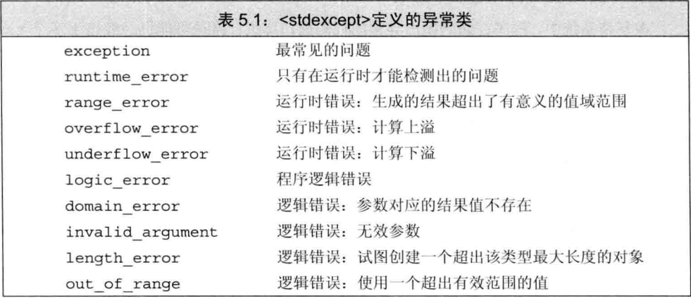

# 语句

## 简单语句

如果在程序的某个地方，语法上需要一条语句但是逻辑上不需要，则应该使用空语句。空语句中只含有一个单独的分号 `;`。

```
while (cin >> s && s != sought)
    ;   //@ 空语句
```

使用空语句时应该加上注释，从而令读这段代码的人知道该语句是有意省略的。

多余的空语句并非总是无害的：

```
while (iter != svec.end()) ;    //@ while 循环的空语句
    ++iter;     //@ 不在是 while 循环的部分
```

复合语句是指用花括号括起来的（可能为空）语句和声明的序列。复合语句也叫做块（block），一个块就是一个作用域。

## 条件语句

### if语句

`if ` 语句的形式：

```
if (condition)
    statement
```

`if-else `语句的形式：

```
if (condition)
    statement
else
    statement2
```

`if `语句可以嵌套，其中 `else` 与离它最近的尚未匹配的 `if` 相匹配。

### switch 语句

- `case` 标签中的值必须是整型常量表达式，并且不能有任何两个 ` case` 具有相同的值。

- 当 `switch` 选中一个 `case` 后会一直执行到最后，如果需要只执行一个 ` case` 则需要主动使用 `break` 。
- `switch` 语句中可以添加一个 `default` 标签，如果没有任何一个 `case` 标签能匹配上 `switch` 表达式的值，程序将执行 `default` 标签后的语句。

- `switch`  语句中涉及到跳过代码，C++ 语言要求一定不能跳过变量的定义而直接跳到使用的地方。如：

```
int val = 1;
switch(val) {
    case 0:
        int passby = 0;
        break;
    case 1:
        ++passby;  //@ 错误，跳过了定义，而直接使用变量 passby
        break;
}
```

## 迭代语句

迭代语句通常称为循环，它重复执行操作直到满足某个条件才停止。`while  ` 和 `for` 语句在执行循环体之前检查条件，`do-while ` 语句先执行循环体再检查条件。

### while语句

`while ` 语句的形式：

```
while (condition)
    statement
```

### 传统的for语句

`for` 语句的形式：

```
for (initializer; condition; expression)
    statement
```

`initializer` 中也可以定义多个对象，但是只能有一条声明语句，因此所有变量的基础类型必须相同。

`for ` 语句头中定义的对象只在 `for` 循环体内可见。

### 范围for语句

范围 `for` 语句的形式：

```
for (declaration : expression)
    statement
```

`expression` 表示一个序列，拥有能返回迭代器的 `begin` 和 `end` 成员。

如果需要对序列中的元素执行写操作，循环变量必须声明成引用类型。每次迭代都会重新定义循环控制变量，并将其初始化为序列中的下一个值，之后才会执行 `statement`。

### do-while语句

`do-while ` 语句的形式：

````
do
    statement
while (condition);
````

计算 `condition` 的值之前会先执行一次 `statement`，`condition` 不能为空。如果 `condition` 的值为 `false`，循环终止，否则重复执行 `statement`。

## 跳转语句

### break语句

`break` 语句只能出现在迭代语句或者 `switch` 语句的内部，负责终止离它最近的 `while`、`do-while`、`for `或者`switch `语句，并从这些语句之后的第一条语句开始执行。

### continue语句

`continue `语句只能出现在迭代语句的内部，负责终止离它最近的循环的当前一次迭代并立即开始下一次迭代。

和 `break` 语句不同的是，只有当 `switch` 语句嵌套在迭代语句内部时，才能在 `switch` 中使用 `continue`。

`continue` 语句中断当前迭代后，具体操作视迭代语句类型而定：

- 对于 `while` 和 `do-while` 语句来说，继续判断条件的值。
- 对于传统的 `for` 语句来说，继续执行 `for` 语句头中的第三部分，之后判断条件的值。
- 对于范围 `for` 语句来说，是用序列中的下一个元素初始化循环变量。

### goto语句

`goto` 语句是一种特殊的语句，在它之前有一个标识符和一个冒号。

`goto ` 语句的形式：

```
goto label;    
```

标识符独立于变量和其他标识符的名字，它们之间不会相互干扰。

建议不要在程序中使用 `goto` 语句，它使得程序既难理解又难修改。

## try语句块和异常处理

异常是指程序运行时的反常行为，这些行为超出了函数正常功能的范围。当程序的某一部分检测到一个它无法处理的问题时，需要使用异常处理。

异常处理机制包括 `throw` 表达式、`try` 语句块和异常类。

- 异常检测部分使用 `throw` 表达式表示它遇到了无法处理的问题。
- 异常处理部分使用 `try` 语句块处理异常。`try `语句块以关键字 `try` 开始，并以一个或多个 `catch` 子句结束。`try `语句块中代码抛出的异常通常会被某个 `catch` 子句处理，`catch `子句也被称作异常处理代码。
- 异常类用于在 `throw` 表达式和相关的 `catch` 子句之间传递异常的具体信息。

### throw表达式

`throw ` 表达式包含关键字 `throw` 和紧随其后的一个表达式，其中表达式的类型就是抛出的异常类型。

### try语句块

`try ` 语句块的通用形式：

```
try 
{
    program-statements
} 
catch (exception-declaration) 
{
    handler-statements
} 
catch (exception-declaration) 
{
    handler-statements
} 
```

如果最终没能找到与异常相匹配的 `catch` 子句，程序会执行名为 `terminate` 的标准库函数。该函数的行为与系统有关，一般情况下，执行该函数将导致程序非正常退出。类似的，如果一段程序没有 `try` 语句块且发生了异常，系统也会调用 `terminate` 函数并终止当前程序的执行。

### 标准异常

异常类分别定义在4个头文件中：

- 头文件 `exception` 定义了最通用的异常类 `exception`。它只报告异常的发生，不提供任何额外信息。
- 头文件 `stdexcept` 定义了几种常用的异常类。
- 头文件 `new` 定义了 `bad_alloc` 异常类。
- 头文件 `type_info` 定义了 `bad_cast` 异常类。



- 只能以默认初始化的方式初始化 `exception`、`bad_alloc` 和 `bad_cast` 对象，不允许为这些对象提供初始值。
- 其他异常类的对象在初始化时必须提供一个 `string` 或一个C风格字符串，通常表示异常信息。`what `成员函数可以返回该字符串的 `string` 副本。


