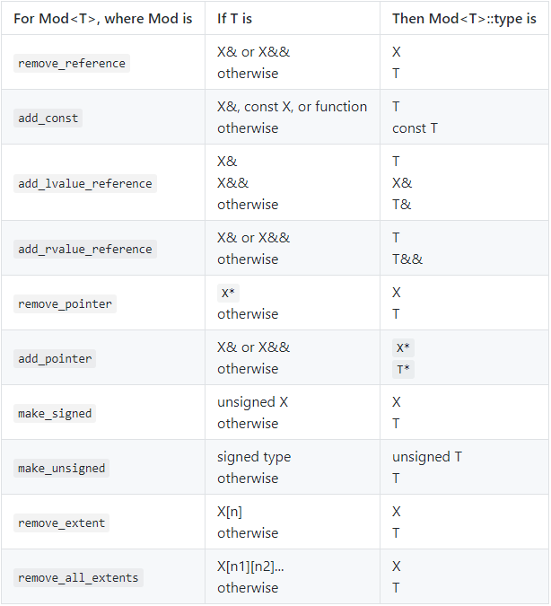

.. contents::
   :depth: 3
..

模板与泛型编程
==============

定义模板
--------

函数模板
~~~~~~~~

函数模板可以用来生成针对特定类型的函数版本。

模板定义以关键字 ``template``
开始，后跟一个模板参数列表。模板参数列表以尖括号 ``<>``
包围，内含用逗号分隔的一个或多个模板参数。

::

   template <typename T>
   int compare(const T &v1, const T &v2)
   {
       if (v1 < v2) return -1;
       if (v2 < v1) return 1;
       return 0;
   }

-  定义模板时，模板参数列表不能为空。
-  模板参数表示在类或函数定义中用到的类型或值。当使用模板时，需要显式或隐式地指定模板实参，并将其绑定到模板参数上。

实例化函数模板
^^^^^^^^^^^^^^

使用函数模板时，编译器用推断出的模板参数来实例化一个特定版本的函数，这些生成的函数通常被称为模板的实例。

::

   //@ 实例化： int compare(const int&, const int&)
   cout << compare(1, 0) << endl;   

   //@ 实例化： instantiates int compare(const vector<int>&, const vector<int>&)
   vector<int> vec1{1, 2, 3}, vec2{4, 5, 6};
   cout << compare(vec1, vec2) << endl;   

模板类型参数
^^^^^^^^^^^^

模板类型参数可以用来指定函数的返回类型或参数类型，以及在函数体内用于变量声明和类型转换。类型参数前必须使用关键字
``class`` 或 ``typename``\ 。

::

   template <typename T>
   T foo(T* p)
   {
       T tmp = *p; 
       // ...
       return tmp;
   }

   //@ 错误，U 之前需要添加 typename 或者 class 关键字
   template <typename T, U> T calc(const T&, const U&);

-  建议使用 ``typename`` 而不是 ``class``
   来指定模板类型参数，这样更加直观。

非类型模板参数
^^^^^^^^^^^^^^

模板非类型参数需要用特定的类型名来指定，表示一个值而非一个类型。非类型参数可以是整型、指向对象或函数类型的指针或左值引用。

::

   template<unsigned N, unsigned M>
   int compare(const char (&p1)[N], const char (&p2)[M])
   {
       return strcmp(p1, p2);
   }

   int compare(const char (&p1)[3], const char (&p2)[4]);

-  绑定到整型非类型参数的实参必须是一个常量表达式。
-  绑定到指针或引用非类型参数的实参必须具有静态的生存期，不能用普通局部变量或动态对象作为指针或引用非类型参数的实参。

内联和constexpr函数模板
^^^^^^^^^^^^^^^^^^^^^^^

函数模板也可以声明为 ``inline`` 或 ``constexpr``
的，说明符放在模板参数列表之后，返回类型之前。

::

   template <typename T> inline T min(const T&, const T&);

编写类型无关的代码
^^^^^^^^^^^^^^^^^^

模板程序应该尽量减少对实参类型的要求。

::

   template <typename T>
   int compare(const T &v1, const T &v2)
   {
       if (less<T>()(v1, v2)) return -1;
       if (less<T>()(v2, v1)) return 1;
       return 0;
   }

模板编译
^^^^^^^^

只有当模板的一个特定版本被实例化时，编译器才会生成代码。此时编译器需要掌握生成代码所需的信息，因此函数模板和类模板成员函数的定义通常放在头文件中。

使用模板时，所有不依赖于模板参数的名字都必须是可见的，这是由模板的设计者来保证的。模板设计者应该提供一个头文件，包含模板定义以及在类模板或成员定义中用到的所有名字的声明。

调用者负责保证传递给模板的实参能正确支持模板所要求的操作。

类模板
~~~~~~

使用一个类模板时，必须提供显式模板实参列表，编译器使用这些模板实参来实例化出特定的类。

::

   template <typename T>
   class Blob
   {
   public:
       Blob();
       Blob(std::initializer_list<T> il);
       void push_back(const T &t) { data->push_back(t); }
       void push_back(T &&t) { data->push_back(std::move(t)); }
       //@ ...
       
   private:
       std::shared_ptr<std::vector<T>> data;
   };

   //@ 实例化类模板
   Blob<int> ia;   
   Blob<int> ia2 = { 0, 1, 2, 3, 4 };   
   Blob<string> names;     
   Blob<double> prices;    

-  一个类模板的每个实例都形成一个独立的类，相互之间没有关联。

类模板的成员函数
^^^^^^^^^^^^^^^^

类模板的成员函数具有和类模板相同的模板参数，因此定义在类模板外的成员函数必须以关键字
``template`` 开始，后跟类模板参数列表。

::

   template <typename T>
   ret-type Blob<T>::member-name(parm-list)

-  默认情况下，一个类模板的成员函数只有当程序用到它时才进行实例化。

-  在类模板自己的作用域内，可以直接使用模板名而不用提供模板实参。

::

   template <typename T>
   class BlobPtr
   {
   public:
       //@ 类模板作用域内不需要写成BlobPtr<T>形式
       BlobPtr& operator++();
   }

   //@ 类外定义时需要提供模板实参
   template <typename T>
   BlobPtr<T>& BlobPtr<T>::operator++()
   {
       //@ 进入类模板作用域
       BlobPtr Ret = *this;
   }

类型模板和友元
^^^^^^^^^^^^^^

当一个类包含一个友元声明时，类与友元各自是否是模板并无关联。

-  如果一个类模板包含一个非模板友元，则友元可以访问所有类模板实例。
-  如果友元自身是模板，则类可以给所有友元模板实例授予访问权限，也可以只授权给特定实例。

一对一友元
''''''''''

最常见的友元形式就是一个类模板与另一个模板（类或函数）的对应实例之间建立友元关系。

如：\ ``Blob`` 类模板和 ``BlobPtr``
类模板之间的友元关系，以及相等性判断（\ ``==``\ ）操作符之间的关系。

::

   template <typename> class BlobPtr;
   template <typename> class Blob;

   template <typename T>
   bool operator==(const Blob<T>&, const Blob<T>&);

   template <typename T> class Blob {
   friend class BlobPtr<T>;
   friend bool operator==<T>(const Blob<T>&, const Blob<T>&);
   };

-  为了指定模板（类或函数）的特定实例，我们必须首先声明模板本身。模板的声明包括模板的模板参数列表。
-  友元声明使用 ``Blob``
   的模板参数作为它们的模板实参。因而，这种友元被严格限定在具有相同类型的模板实参的
   ``BlobPtr`` 和相等操作符的实例之间。如：

::

   Blob<char> ca; //@ BlobPtr<char> and operator==<char> are friends
   Blob<int> ia; //@ BlobPtr<int> and operator==<int> are friends

``BlobPtr<char>`` 的成员可以访问 ``ca`` 的非共有部分，但 ``ca`` 与
``ia`` 之间没有任何特殊的访问权限。

通用和特定的模板友元关系
''''''''''''''''''''''''

一个类可以让另一个模板的所有实例都是其友元，或者将友元限定在某一个特定的实例。

::

   template <typename T> class Pal;
   class C {
   friend class Pal<C>; //Pal instantiated with class C is a friend to C
   //all instances of Pal2 are friends to C;
   //no forward declaration required when we befriend all instantiations
   template <typename T> friend class Pal2;
   };
   template <typename T> class C2 {
   //each instantiation of C2 has the same instance of Pal as a friend
   friend class Pal<T>; //a template declaration for Pal must be in scope

   //all instances of Pal2 are friends of each instance of C2,
   //prior declaration is not needed
   template <typename X> friend class Pal2;

   //Pal3 is a nontemplate class that is a friend of every instance of C2
   //prior declaration for Pal3 is not needed
   friend class Pal3;
   };

与模板本身的类型参数成为友元
''''''''''''''''''''''''''''

C++11 中，类模板可以将模板类型参数声明为友元。

::

   template <typename Type>
   class Bar
   {
       friend Type;   // grants access to the type used to instantiate Bar
       // ...
   };

模板的类型别名
''''''''''''''

可以定义一个 ``typedef`` 来作为实例化类的别名：

::

   typedef Blob<string> StrBlob;

由于模板不是类型，所以不能定义 ``typedef``
作为模板的别名。也就是说不能定义 ``typedef`` 来指向 ``Blob<T>``\ 。

在新标准下可以用 ``using`` 声明来指定类模板的别名。如：

::

   template <typename T> using twin = pair<T, T>;
   twin<string> authors;   //@ authors is a pair<string, string>

当定义模板类型别名时，可以固定一个或多个模板参数，如：

::

   template <typename T> using partNo = pair<T, unsigned>;

类模板的静态成员
''''''''''''''''

类模板可以声明 ``static`` 成员。

::

   template <typename T> class Foo {
   public:
       static std::size_t count() { return ctr; }
   private:
       static std::size_t ctr;
   };

类模板的每个实例都有一个独有的 ``static`` 对象，而每个 ``static``
成员必须有且只有一个定义。因此与定义模板的成员函数类似，\ ``static``\ 成员也应该定义成模板。

::

   template <typename T>
   size_t Foo<T>::ctr = 0;    //@ 定义和初始化 ctr

模板参数
~~~~~~~~

模板参数和作用域
^^^^^^^^^^^^^^^^

模板参数遵循普通的作用域规则。与其他任何名字一样，模板参数会隐藏外层作用域中声明的相同名字。但是在模板内不能重用模板参数名。

::

   typedef double A;
   template <typename A, typename B>
   void f(A a, B b)
   {
       A tmp = a; //@ tmp 的类型是模板参数 A，不是double
       double B; //@ 错误，重定义了模板参数 B
   }

由于模板参数名不能重用，所以一个名字在一个特定模板参数列表中只能出现一次。

::

   //@ 错误，模板参数名字只能一次
   template <typename V, typename V> 

模板声明
^^^^^^^^

模板声明必须包含模板的参数列表，如：

::

   template <typename T> int compare(const T &, const T &);
   template <typename T> class Blob;

与函数参数一样，模板参数的名字不需要在声明和定义之间完全一样，如：

::

   template <typename T> T calc(const T &, const T &);
   template <typename U> U calc(const U &, const U &);
   template <typename Type>
   Type calc(const Type &a, const Type &b) { /* ... */ }

以上三个用法都是表示同一个函数模板。

一个特定文件所需要的所有模板声明通常一起放置在文件开始位置，出现在任何使用这些模板的代码之前。

使用类的类型成员
^^^^^^^^^^^^^^^^

模板中的代码使用作用域运算符 ``::``
时，编译器无法确定其访问的名字是类型还是 ``static`` 成员。

::

   T::size_type * p;

编译器必须知道 ``size_type`` 是类型，这是在定义一个名字 ``p``
的变量，不然，就不会被处理为静态数据成员 ``size_type`` 与变量 ``p``
相乘。

默认情形下，语言认为通过作用域操作符访问的名字不是类型。如果要使用一个模板类型参数的类型成员，必须显式告知编译器这个名字是类型。那就得用
``typename`` 这个关键字了。如：

::

   template <typename T>
   typename T::value_type top(const T &c)
   {
       if (!c.empty())
           return c.back();
       else
           return typename T::value_type();
   }

以上函数期待一个容器作为其实参，使用 ``typename``
类指定其返回类型，并且在没有元素的情况下生成一个值初始化的元素用于返回。

当想要告知编译器一个名字表示类型时，必须使用关键字 ``typename`` 而不是
``class``\ 。

默认模板实参
^^^^^^^^^^^^

与可以给函数参数提供默认实参一样，可以提供默认模板实参，在新标准下可以给函数和类模板提供默认实参。早期的语言版本只允许给类模板提供默认实参。如：

::

   template <typename T, typename F = less<T>>
   int compare(const T &v1, const T &v2, F f = F())
   {
       if (f(v1, v2)) return -1;
       if (f(v2, v1)) return 1;
       return 0;
   }

与函数默认参数一样，模板参数的默认实参只有在其右侧的所有参数都具有默认实参时才是合法的。

模板默认实参和类模板
^^^^^^^^^^^^^^^^^^^^

如果一个类模板为其所有模板参数都提供了默认实参，在使用这些默认实参时，必须在模板名后面跟一个空尖括号对
``<>``\ 。

::

   template <class T = int>
   class Numbers {
   public:
       Numbers(T v = 0):val(v) { }
   private:
       T val;
   };
   Numbers<long double> lots_of_precision;
   Numbers<> average_precision; 

成员模板
~~~~~~~~

一个类（无论是普通类还是模板类）可以包含本身是模板的成员函数，这种成员被称为成员模板。成员模板不能是虚函数。

常规类的成员模板
^^^^^^^^^^^^^^^^

常规类中的成员模板与模板函数的写法完全一样。如：

::

   class DebugDelete {
   public:
       DebugDelete(std::ostream &s = std::cerr):os(s) { }
       template <typename T>
       void operator()(T *p) const
       {
           os << "delete unique_ptr" << std::endl;
           delete p;
       }
   private:
       std::ostream &os;
   };

用法如下：

::

   double *p = new double;
   DebugDelete d;
   d(p);
   int *ip = new int;
   DebugDelete()(ip);

也可以被用于构建 ``unique_ptr`` 对象。如：

::

   unique_ptr<int, DebugDelete> p(new int, DebugDelete());
   unique_ptr<string, DebugDelete> sp(new string, DebugDelete());

类模板的成员模板
^^^^^^^^^^^^^^^^

可以给类模板定义成员模板，在这种情况下，类和成员的模板参数是各自独立的。如：

::

   template <typename T> class Blob {
       template <typename It> Blob(It b, It e);
   };

为了实例化一个类模板的成员模板，必须同时提供类和函数模板的实参。

::

   template <typename T>
   template <typename It>
   Blob<T>::Blob(It b, It e):data(std::make_shared<std::vector<T>>(b, e)) { }

控制实例化
~~~~~~~~~~

因为模板在使用时才会进行实例化，所以相同的实例可能出现在多个对象文件中。当两个或多个独立编译的源文件使用了相同的模板，并提供了相同的模板参数时，每个文件中都会有该模板的一个实例。

在大型程序中，多个文件实例化相同模板的额外开销可能非常严重。C++11
允许通过显式实例化来避免这种开销。

显式实例化的形式如下：

::

   extern template declaration;    
   template declaration;          

``declaration``
是一个类或函数声明，其中所有模板参数已被替换为模板实参。当编译器遇到
``extern``
模板声明时，它不会在本文件中生成实例化代码。对于一个给定的实例化版本，可能有多个
``extern`` 声明，但必须只有一个定义。

::

   template int compare(const int&, const int&);
   template class Blob<string>;  

   extern template class Blob<string>;
   extern template int compare(const int&, const int&);
   Blob<string> sa1, sa2;

   Blob<int> a1 = { 0, 1, 2, 3, 4, 5, 6, 7, 8, 9 };
   Blob<int> a2(a1);   
   int i = compare(a1[0], a2[0]);  

当编译器遇到类模板的实例化定义时，它不清楚程序会使用哪些成员函数。和处理类模板的普通实例化不同，编译器会实例化该模板的所有成员，包括内联的成员函数。因此，用来显式实例化类模板的类型必须能用于模板的所有成员。

效率与灵活性
~~~~~~~~~~~~

``shared_ptr`` 可以在创建或 ``reset``
指针时传递一个删除器来轻松覆盖之前的。

``unique_ptr`` 的删除器却是类型的一部分，必须在定义 ``unique_ptr``
就显式提供一个类型作为模板实参，因而，给 ``unique_ptr``
定制删除器会更加复杂。

在运行时绑定删除器
^^^^^^^^^^^^^^^^^^

``shared_ptr``
的删除器是间接存储的，意味着可能作为指针或者一个包含指针的类，这是由于其删除器直到运行时才能被知道是何种类型，而且在其生命周期中还可以不断改变。

在编译期绑定删除器
^^^^^^^^^^^^^^^^^^

由于删除器的类型是作为 ``unique_ptr``
的类型参数指定的，意味着删除器的类型可以在编译期就知道，因而，此删除器可以被直接存储。

通过在编译期绑定删除器，\ ``unique_ptr``
避免了调用删除器的运行时消耗；通过在运行时绑定删除器，\ ``shared_ptr``
带来了灵活性，使其更容易定制新的删除器。

模板实参推断
------------

对于函数模板，编译器通过调用的函数实参来确定其模板参数。这个过程被称作模板实参推断。

类型转换与模板类型参数
~~~~~~~~~~~~~~~~~~~~~~

与非模板函数一样，调用函数模板时传递的实参被用来初始化函数的形参。

-  如果一个函数形参的类型使用了模板类型参数，则会采用特殊的初始化规则，只有有限的几种类型转换会自动地应用于这些实参。
-  编译器通常会生成新的模板实例而不是对实参进行类型转换。

有3种类型转换可以在调用中应用于函数模板：

-  顶层 ``const``\ 会被忽略。
-  可以将一个非 ``const`` 对象的引用或指针传递给一个 ``const``
   引用或指针形参。
-  如果函数形参不是引用类型，则可以对数组或函数类型的实参应用正常的指针转换。数组实参可以转换为指向其首元素的指针。函数实参可以转换为该函数类型的指针。

其他的类型转换，如算术转换、派生类向基类的转换以及用户定义的转换，都不能应用于函数模板。

一个模板类型参数可以作为多个函数形参的类型。由于允许的类型转换有限，因此传递给这些形参的实参必须具有相同的类型，否则调用失败。

::

   long lng;
   compare(lng, 1024);   //@ 错误，不能实例化 compare(long, int)

如果想增强函数的兼容性，可以使用两个类型参数定义函数模板。

::

   template <typename A, typename B>
   int flexibleCompare(const A& v1, const B& v2)
   {
       if (v1 < v2) return -1;
       if (v2 < v1) return 1;
       return 0;
   }

   long lng;
   flexibleCompare(lng, 1024);   //@ 正确，可以实例化 flexibleCompare(long, int)

函数模板中使用普通类型定义的参数可以进行正常的类型转换。

::

   template <typename T>
   ostream &print(ostream &os, const T &obj)
   {
       return os << obj;
   }

   print(cout, 42);   //@ 实例化 print(ostream&, int)
   ofstream f("output");
   print(f, 10);      //@ 实例化 print(ostream&, int); converts f to ostream&

函数模板显式实参
~~~~~~~~~~~~~~~~

某些情况下，编译器无法推断出模板实参的类型。

指定显示模板实参
^^^^^^^^^^^^^^^^

通过定义额外的模板参数来表示返回值的类型，如：

::

   template <typename T1, typename T2, typename T3>
   T1 sum(T2, T3);

显式模板实参可以让用户自己控制模板的实例化。提供显式模板实参的方式与定义类模板实例的方式相同。显式模板实参在尖括号
``<>`` 中指定，位于函数名之后，实参列表之前。

::

   auto val3 = sum<long long>(i, lng);   //@ 实例化 long long sum(int, long)

显式模板实参按照从左到右的顺序与对应的模板参数匹配，只有尾部参数的显式模板实参才可以忽略，而且前提是它们可以从函数参数推断出来。

::

   template <typename T1, typename T2, typename T3>
   T3 alternative_sum(T2, T1);

   //@ 错误，不能从模板参数初始化
   auto val3 = alternative_sum<long long>(i, lng);
   //@ 正确，显式初始化
   auto val2 = alternative_sum<long long, int, long>(i, lng);

对于模板类型参数已经显式指定了的函数实参，可以进行正常的类型转换。

::

   long lng;
   compare(lng, 1024);         //@ 错误，模板参数不匹配
   compare<long>(lng, 1024);   //@ 正确， compare(long, long)
   compare<int>(lng, 1024);    //@ 正确， compare(int, int)

尾置返回类型与类型转换
~~~~~~~~~~~~~~~~~~~~~~

由于尾置返回出现在函数列表之后，因此它可以使用函数参数来声明返回类型。

::

   template <typename It>
   auto fcn(It beg, It end) -> decltype(*beg)
   {
       //@ process the range
       return *beg;  
   }

标准库在头文件 ``<type_traits>``
中定义了类型转换模板，这些模板常用于模板元程序设计。其中每个模板都有一个名为
``type``
的公有类型成员，表示一个类型。此类型与模板自身的模板类型参数相关。如果不可能（或不必要）转换模板参数，则
``type`` 成员就是模板参数类型本身。

|image0|

以上表格中的 ``remove_reference``
用于获取元素类型，如：\ ``remove_reference<int&>::type`` 的结果是 int
类型。上面的难题的解决方案就是用
``remove_reference<decltype(*beg)>::type`` 表示 beg
所指向的元素的值类型。如：

::

   template <typename It>
   auto fcn2(It beg, It end) -> typename remove_reference<decltype(*beg)>::type
   {
       return *beg;
   }

函数指针和实参推断
~~~~~~~~~~~~~~~~~~

使用函数模板初始化函数指针或为函数指针赋值时，编译器用指针的类型来推断模板实参。

::

   int (*pf1)(const int&, const int&) = compare;

如果编译器不能从函数指针类型确定模板实参，则会产生错误。使用显式模板实参可以消除调用歧义。

::

   void func(int(*)(const string&, const string&));
   void func(int(*)(const int&, const int&));
   func(compare);     //@ 错误，调用有歧义
   func(compare<int>);   //@ 正确，显式指出类型

模板实参推断和引用
~~~~~~~~~~~~~~~~~~

如果函数的参数是模板类型的引用，需要记住的是：常见的引用绑定规则依然有效（左值只能绑定到左值，右值只能绑定到右值）；并且此时
const 是底层 const 而不是顶层 const 。

左值引用函数参数的类型推断
^^^^^^^^^^^^^^^^^^^^^^^^^^

当一个函数参数是模板类型参数的左值引用如：\ ``T&``\ ，绑定规则告诉我们只能传递左值过去，实参可以有
``const`` 修饰，如果实参是 ``const`` 的，那么 ``T`` 将被推断为 ``const``
类型。如：

::

   template <typename T> void f1(T&);
   f1(i); //@ i 是 int; T 是 int 
   f1(ci); //@ ci 是 const int; T 也是 const int
   f1(5); //@ 错误，模板初始化参数必须是左值

当一个函数参数是模板类型参数的常量引用（形如
``const T&``\ ）时，可以传递给它任何类型的实参。函数参数本身是 ``const``
时，\ ``T`` 的类型推断结果不会是 ``const``
类型。\ ``const``\ 已经是函数参数类型的一部分了，因此不会再是模板参数类型的一部分。

::

   template <typename T> void f2(const T&); 

   f2(i);     //@ i 是 int
   f2(ci);    //@ ci 是 const int
   f2(5);     //@ const& 可以绑定右值

右值引用函数参数的类型推断
^^^^^^^^^^^^^^^^^^^^^^^^^^

当一个函数参数是模板类型参数的右值引用（形如\ ``T&&``\ ）时，如果传递给它一个右值，类型推断过程类似普通左值引用函数参数的推断过程，推断出的
``T`` 类型是该右值实参的类型。

::

   template <typename T> void f3(T&&);
   f3(42);    //@ 参数是一个右值

引用折叠
^^^^^^^^

模板参数绑定的两个例外规则：

-  如果将一个左值传递给函数的右值引用参数，且此右值引用指向模板类型参数时，编译器推断模板类型参数为实参的左值引用类型。
-  如果间接创建了一个引用的引用（通过类型别名或者模板类型参数间接定义），则这些引用会被“折叠”。右值引用的右值引用会被折叠为右值引用。其他情况下，引用都被折叠为普通左值引用。

引用折叠规则：

-  ``X& &``, ``X& &&`` 和 ``X&& &`` 被折叠为类型 ``X&``\ 。
-  ``X&& &&`` 被折叠为 ``X&&``\ 。

模板参数绑定的两个例外规则导致了两个结果：

-  如果一个函数参数是指向模板类型参数的右值引用，则可以传递给它任意类型的实参。
-  如果将一个左值传递给这样的参数，则函数参数被实例化为一个普通的左值引用。

当代码中涉及的类型可能是普通（非引用）类型，也可能是引用类型时，编写正确的代码就变得异常困难。

::

   template <typename T>
   void f3(T&& val)
   {
       T t = val;     
       t = fcn(t);   
       if (val == t) { /* ... */ }    
   }

实际编程中，模板的右值引用参数通常用于两种情况：模板转发其实参或者模板被重载。函数模板的常用重载形式如下：

::

   template <typename T> void f(T&&);         
   template <typename T> void f(const T&);    

理解std::move
~~~~~~~~~~~~~

``std::move`` 的定义如下：

::

   template <typename T>
   typename remove_reference<T>::type&& move(T&& t)
   {
       return static_cast<typename remove_reference<T>::type&&>(t);
   }

``std::move`` 的工作过程：

::

   string s1("hi!"), s2;
   s2 = std::move(string("bye!"));    
   s2 = std::move(s1);    

-  在 ``std::move(string("bye!"))`` 中传递的是右值。

   -  推断出的 ``T`` 类型为 ``string``\ 。
   -  ``remove_reference`` 用 ``string`` 进行实例化。
   -  ``remove_reference<string>`` 的 ``type`` 成员是 ``string``\ 。
   -  ``move`` 的返回类型是 ``string&&``\ 。
   -  ``move`` 的函数参数 ``t`` 的类型为 ``string&&``\ 。

-  在 ``std::move(s1)`` 中传递的是左值。

   -  推断出的 ``T`` 类型为 ``string&``\ 。
   -  ``remove_reference`` 用 ``string&`` 进行实例化。
   -  ``remove_reference<string&>`` 的 ``type``\ 成员是 ``string``\ 。
   -  ``move`` 的返回类型是 ``string&&``\ 。
   -  ``move`` 的函数参数 ``t`` 的类型为 ``string& &&``\ ，会折叠成
      ``string&``\ 。

可以使用 ``static_cast`` 显式地将一个左值转换为一个右值引用。

转发
~~~~

某些函数需要将其一个或多个实参连同类型不变地转发给其他函数。在这种情况下，需要保持被转发实参的所有性质，包括实参的
``const`` 属性以及左值/右值属性。

::

   template <typename F, typename T1, typename T2>
   void flip1(F f, T1 t1, T2 t2)
   {
       f(t2, t1);
   }

   void f(int v1, int &v2)   
   {
       cout << v1 << " " << ++v2 << endl;
   }

   f(42, i);   
   flip1(f, j, 42);   

将函数参数定义为指向模板类型参数的右值引用（形如\ ``T&&``\ ），通过引用折叠，可以保持翻转实参的左值/右值属性。并且引用参数（无论是左值还是右值）可以保持实参的
``const`` 属性，因为在引用类型中的 ``const`` 是底层的。

::

   template <typename F, typename T1, typename T2>
   void flip2(F f, T1 &&t1, T2 &&t2)
   {
       f(t2, t1);
   }

对于修改后的版本，若调用 ``flip2(f, j, 42)``\ ，会传递给参数 ``t1``
一个左值 ``j``\ ，但此时推断出的 ``T1`` 类型为\ ``int&``\ ，\ ``t1``
的类型会被折叠为\ ``int&``\ ，从而解决了 ``flip1`` 的错误。

但 ``flip2``
只能用于接受左值引用的函数，不能用于接受右值引用的函数。函数参数与其他变量一样，都是左值表达式。所以即使是指向模板类型的右值引用参数也只能传递给接受左值引用的函数，不能传递给接受右值引用的函数。

::

   void g(int &&i, int& j)
   {
       cout << i << " " << j << endl;
   }

   //@ 错误，不能使用左值初始化 int&& 
   flip2(g, i, 42);  

C++11 在头文件 ``<utility>`` 中定义了 ``forward``\ 。与 ``move``
不同，\ ``forward``
必须通过显式模板实参调用，返回该显式实参类型的右值引用。即
``forward<T>`` 返回类型 ``T&&``\ 。

通常情况下，可以使用 ``forward``
传递定义为指向模板类型参数的右值引用函数参数。通过其返回类型上的引用折叠，\ ``forward``
可以保持给定实参的左值/右值属性。

::

   template <typename Type>
   intermediary(Type &&arg)
   {
       finalFcn(std::forward<Type>(arg));
       // ...
   }

-  如果实参是一个右值，则 ``Type``
   是一个普通（非引用）类型，\ ``forward<Type>`` 返回类型 ``Type&&``\ 。
-  如果实参是一个左值，则通过引用折叠，\ ``Type``
   也是一个左值引用类型，\ ``forward<Type>`` 返回类型
   ``Type&& &``\ ，对返回类型进行引用折叠，得到 ``Type&``\ 。

使用 ``forward`` 编写完善的转发函数。

::

   template <typename F, typename T1, typename T2>
   void flip(F f, T1 &&t1, T2 &&t2)
   {
       f(std::forward<T2>(t2), std::forward<T1>(t1));
   }

与 ``std::move``\ 一样，对 ``std::forward`` 也不应该使用 ``using``
声明。

重载与模板
----------

函数模板可以被另一个模板或普通非模板函数重载。

如果重载涉及函数模板，则函数匹配规则会受到一些影响：

-  对于一个调用，其候选函数包括所有模板实参推断成功的函数模板实例。
-  候选的函数模板都是可行的，因为模板实参推断会排除任何不可行的模板。
-  和往常一样，可行函数（模板与非模板）按照类型转换（如果需要的话）来排序。但是可以用于函数模板调用的类型转换非常有限。
-  和往常一样，如果恰有一个函数提供比其他任何函数都更好的匹配，则选择此函数。但是如果多个函数都提供相同级别的匹配，则：

   -  如果同级别的函数中只有一个是非模板函数，则选择此函数。
   -  如果同级别的函数中没有非模板函数，而有多个函数模板，且其中一个模板比其他模板更特例化，则选择此模板。
   -  否则该调用有歧义。

通常，如果使用了一个没有声明的函数，代码将无法编译。但对于重载函数模板的函数而言，如果编译器可以从模板实例化出与调用匹配的版本，则缺少的声明就不再重要了。

::

   template <typename T> string debug_rep(const T &t);
   template <typename T> string debug_rep(T *p);

   string debug_rep(const string &);
   string debug_rep(char *p)
   {
       return debug_rep(string(p));
   }

在定义任何函数之前，应该声明所有重载的函数版本。这样编译器就不会因为未遇到你希望调用的函数而实例化一个并非你所需要的版本。

可变参数模板
------------

可变参数模板指可以接受可变数量参数的模板函数或模板类。可变数量的参数被称为参数包，分为两种：

-  模板参数包，表示零个或多个模板参数。
-  函数参数包，表示零个或多个函数参数。

用一个省略号\ ``…``
来指出模板参数或函数参数表示一个包。在一个模板参数列表中，\ ``class…``
或 ``typename…``
指出接下来的参数表示零个或多个类型的列表；一个类型名后面跟一个省略号表示零个或多个给定类型的非类型参数列表。在函数参数列表中，如果一个参数的类型是模板参数包，则此参数也是函数参数包。

::

   template <typename T, typename... Args>
   void foo(const T &t, const Args& ... rest);

对于一个可变参数模板，编译器会推断模板参数类型和参数数量。

可以使用 ``sizeof…`` 运算符获取参数包中的元素数量。类似
``sizeof``\ ，\ ``sizeof…`` 也返回一个常量表达式，而且不会对其实参求值。

::

   template<typename ... Args>
   void g(Args ... args)
   {
       cout << sizeof...(Args) << endl;    //@ number of type parameters
       cout << sizeof...(args) << endl;    //@ number of function parameters
   }

编写可变参数函数模板
~~~~~~~~~~~~~~~~~~~~

可变参数函数通常是递归的，第一步调用参数包中的第一个实参，然后用剩余实参调用自身。为了终止递归，还需要定义一个非可变参数的函数。

::

   template<typename T>
   ostream &print(ostream &os, const T &t)
   {
       return os << t;   
   }

   template <typename T, typename... Args>
   ostream &print(ostream &os, const T &t, const Args&... rest)
   {
       os << t << ", ";   
       return print(os, rest...);   
   }

包扩展
~~~~~~

对于一个参数包，除了获取其大小外，唯一能对它做的事情就是扩展。当扩展一个包时，需要提供用于每个扩展元素的模式。扩展一个包就是将其分解为构成的元素，对每个元素应用模式，获得扩展后的列表。通过在模式右边添加一个省略号
``…`` 来触发扩展操作。

包扩展工作过程：

::

   template <typename T, typename... Args>
   ostream& print(ostream &os, const T &t, const Args&... rest)  
   {
       os << t << ", ";
       return print(os, rest...);   // expand rest
   }

-  第一个扩展操作扩展模板参数包，为 ``print``
   生成函数参数列表。编译器将模式 ``const Args&`` 应用到模板参数包
   ``Args``
   中的每个元素上。因此该模式的扩展结果是一个以逗号分隔的零个或多个类型的列表，每个类型都形如
   ``const type&``\ 。

::

   print(cout, i, s, 42);   
   ostream& print(ostream&, const int&, const string&, const int&);

-  第二个扩展操作扩展函数参数包，模式是函数参数包的名字。扩展结果是一个由包中元素组成、以逗号分隔的列表。

::

   print(os, s, 42);

扩展操作中的模式会独立地应用于包中的每个元素。

::

   template <typename... Args>
   ostream &errorMsg(ostream &os, const Args&... rest)
   {
       return print(os, debug_rep(rest)...);
   }

   print(os, debug_rep(rest...));   //@ 错误，没有匹配的函数

转发参数包
~~~~~~~~~~

在 C++11 中，可以组合使用可变参数模板和 ``forward``
机制来编写函数，实现将其实参不变地传递给其他函数。

::

   template<typename... Args>
   void fun(Args&&... args)    
   {
       work(std::forward<Args>(args)...);
   }

模板特例化
----------

当不想或者不能使用模板版本时，可以定义一个类或函数模板的特例化版本。如：

::

   template <typename T> int compare(const T &, const T &);  //@ (1)

   template <size_t N, size_t M>
   int compare(const char(&)[N], const char(&)[M]);  //@ (2)

   const char *p1 = "hi", *p2 = "mom";
   compare(p1, p2); //@ calls (1) template
   compare("hi" "mom"); //@ calls (2) template

特例是模板的另外一个定义，其中一个或多个目标那参数具有特定的类型。

定义函数模板特例
~~~~~~~~~~~~~~~~

当定义函数模板特例时，需要给原模板中所有的模板参数提供实参。为了表示我们的确是在特例化一个模板，需要使用关键字
``tempalte`` 后跟随一个空的尖括号 ``<>``
，空的尖括号表示给原模板中的所有模板参数都提供了实参。

::

   template <>
   int comapre(const char* const &p1, const char* const &p2) 
   {
       return strcmp(p1, p2);
   }

函数重载vs模板特例
~~~~~~~~~~~~~~~~~~

特别需要留意的是特例是一个实例；它不是重载；由于特例实例化一个模板；它不重载这个模板，因而，特例不会影响函数匹配过程。

将一个特殊版本的函数定义为特例化模板还是独立的非模板函数会影响到重载函数匹配。

模板特例化遵循普通作用域规则。为了特例化一个模板，原模板的声明必须在作用域中。而使用模板实例时，也必须先包含特例化版本的声明。

模板和它的特例应该定义在同一个头文件中，而且同一个名字的所有模板都应该出现在前面，后面跟随这些模板的特例。

类模板特例
~~~~~~~~~~

::

   #include <functional>
   #include <iostream>

   struct Sales_data {
       std::string bookNo;
       unsigned units_sold = 0;
       double revenue = 0.0;
   };

   namespace std {

   template <>
   struct hash<Sales_data>
   {
       typedef size_t result_type;
       typedef Sales_data argument_type;
       size_t operator()(const Sales_data &s) const;
   };

   size_t
   hash<Sales_data>::operator()(const Sales_data &s) const
   {
       return hash<std::string>()(s.bookNo) ^
           hash<unsigned>()(s.units_sold) ^
           hash<double>()(s.revenue);
   }

   }; // namespace std

   template <typename T>
   struct remove_reference {
       typedef T type;
   };

   template <typename T>
   struct remove_reference<T&> {
       typedef T type;
   };

   template <typename T>
   struct remove_reference<T&&> {
       typedef T type;
   };

   //////////////////////////////////////////////////////

   template <typename T>
   struct Foo {
       Foo(const T &t = T()) : mem(t) {  }
       void Bar() {
           std::cout << "generic Foo::Bar()" << std::endl;
           std::cout << mem << std::endl;
       }
       T mem;
   };

   template <>
   void Foo<int>::Bar()
   {
       std::cout << "specialization Foo<int>::Bar()" << std::endl;
       std::cout << mem << std::endl;
   }

类模板部分特例
~~~~~~~~~~~~~~

类模板也可以特例化。与函数模板不同，类模板的特例化不必为所有模板参数提供实参，可以只指定一部分模板参数。一个类模板的部分特例化版本本身还是一个模板，用户使用时必须为那些未指定的模板参数提供实参。

只能部分特例化类模板，不能部分特例化函数模板。

部分特化的一个很好的例子是 ``remove_reference`` 类，实现如下：

::

   //@ 通用版本
   template <typename T>
   struct remove_reference
   {
       typedef T type;
   };

   //@ 部分特例化版本
   template <typename T>
   struct remove_reference<T &>   //@ 左值引用
   {
       typedef T type;
   };

   template <typename T>
   struct remove_reference<T &&>  //@ 右值引用
   {
       typedef T type;
   };

类模板部分特例化版本的模板参数列表是原始模板参数列表的一个子集或特例化版本。

仅仅特化成员而不是整个类
~~~~~~~~~~~~~~~~~~~~~~~~

可以只特例化类模板的指定成员函数，而不用特例化整个模板。

::

   template <typename T> struct Foo {
       Foo(const T &t = T()) : mem(t) { }
       void Bar() { /* ... */}
       T mem;
   };
   template <>
   void Foo<int>::Bar()
   {
       // do whatever specialized processing that applies to ints
   }

此例中仅特化一个 ``Foo<int>`` 的一个成员 Bar，\ ``Foo<int>``
的其他成员将由 ``Foo`` 模板提供。如：

::

   Foo<string> fs; //@ instantiates Foo<string>::Foo()
   fs.Bar(); //@ instantiates Foo<string>::Bar()
   Foo<int> fi; //@ instantiates Foo<int>::Foo()
   fi.Bar(); //@ uses our specialization of Foo<int>::Bar()

