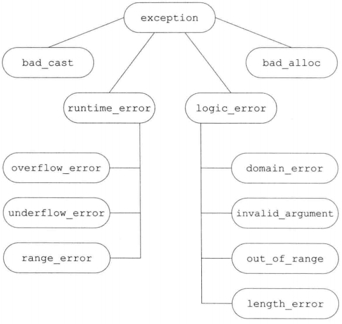

.. contents::
   :depth: 3
..

用于大型程序的工具
==================

异常处理
--------

异常处理机制允许程序中独立开发的部分能够在运行时就出现的问题进行通信并作出相应的处理。

抛出异常
~~~~~~~~

在 C++ 语言中，我们通过抛出一条表达式来引发一个异常。

异常类型和当前的调用链决定了哪段处理代码将用来处理该异常。

执行一个 ``throw`` 语句时，跟在 ``throw``
后面的语句将不再执行。程序的控制权从 ``throw`` 转移到与之匹配的
``catch`` 语句中。该 ``catch`` 可能是同一个函数中的局部
``catch``\ ，也可能位于直接或间接调用了发生异常的函数的另一个函数中。控制权的转移意味着两个问题：

-  沿着调用链的函数可能会提前退出。
-  一旦程序开始执行异常处理代码，则沿着调用链创建的对象会被销毁。

栈展开
^^^^^^

抛出异常后，程序暂停执行当前函数并立即寻找对应 ``catch``
语句的过程叫做栈展开。

栈展开沿着嵌套函数的调用链不断查找，直到找到了与异常匹配的 ``catch``
语句为止。如果没有对应的 ``catch`` 语句，则退出主函数后查找过程结束。

-  如果找到了匹配的 ``catch``
   语句，则程序进入该子句并执行其中的代码。\ ``catch``\ 语句执行结束后，程序会转移到与
   ``try`` 块关联的最后一个 ``catch`` 语句之后的位置继续执行。
-  如果没有找到匹配的 ``catch`` 语句，程序会调用标准库的 ``terminate``
   函数，终止运行。

栈展开时对象将自动被销毁
^^^^^^^^^^^^^^^^^^^^^^^^

在栈展开过程中，位于调用链上的语句块可能会提前退出，其中的局部对象也会被销毁。

如果异常发生在构造函数或者数组及容器的元素初始化过程中，则当前的对象可能只构造了一部分，此时必须确保已构造的成员能被正确销毁。

析构函数和异常
^^^^^^^^^^^^^^

由于栈展开可能会调用析构函数，因此析构函数不应该抛出不能被它自身处理的异常。。即，如果析构函数需要执行某个可能引发异常的操作，则该操作应该被放置在一个
``try`` 语句块中，并在析构函数内部得到处理。

实际编程中，析构函数仅仅是释放资源，不太可能引发异常。所有的标准库类型都能确保它们的析构函数不会引发异常。

异常对象
^^^^^^^^

编译器使用抛出表达式来拷贝复制一个特殊对象称为异常对象。

-  抛出的对象必须是完全类型。

-  如果对象是类类型，那么其必须具有可访问的析构函数和可访问的拷贝或移动构造函数。
-  如果对象是数组或者函数类型，那么其将被转型为对应的指针类型。
-  抛出一条表达式时，该表达式的静态编译类型决定了异常对象的类型。如果
   ``throw``
   表达式解引用一个基类指针，而该指针实际指向派生类对象，则只有基类部分会被抛出。
-  抛出指针时必须确保在任何对应的处理代码中，指针指向的对象一定存在。抛出本地对象的指针是错误的用法，因为在栈展开时本地对象会被销毁。

捕获异常
~~~~~~~~

``catch`` 语句中的异常声明类似只包含一个形参的函数形参列表。

-  声明的类型决定了处理代码所能捕获的异常类型。该类型必须是完全类型，可以是左值引用，但不能是右值引用。
-  如果 ``catch`` 无须访问抛出的表达式，则可以忽略捕获形参的名字。

进入 ``catch`` 语句后，使用异常对象初始化异常声明中的参数。\ ``catch``
参数的特性和函数参数类似。

-  如果 ``catch``
   的参数类型是非引用类型，则该参数是异常对象的一个副本，改变参数不会影响异常对象本身。
-  如果 ``catch``
   的参数类型是引用类型，则该参数是异常对象的一个别名，改变参数就是改变异常对象本身。
-  在继承体系中，如果 ``catch``
   的参数类型是基类类型，则可以使用其派生类类型的异常对象对其初始化。

   -  ``catch`` 的参数是基类非引用类型时，异常对象会被切除一部分。
   -  ``catch`` 的参数是基类引用类型时，以常规方式绑定到异常对象。

异常声明的静态类型决定了 ``catch`` 语句所能执行的操作。如果 ``catch``
的参数是基类类型，则无法使用派生类特有的成员。

通常情况下，如果 ``catch`` 接受的异常与某个继承体系有关，则最好将
``catch`` 参数定义为引用类型。

查找一个匹配的处理器
^^^^^^^^^^^^^^^^^^^^

查找异常处理代码时，最终结果是第一个与异常匹配的 ``catch``
语句，但这未必是最佳匹配。因此，越特殊的 ``catch`` 越应该位于整个
``catch``
列表的前端。当程序使用具有继承关系的异常时，派生类异常的处理代码应该位于基类异常的处理代码之前。

异常和异常声明的匹配规则比函数参数严格，只有极少数的转换是允许的:

-  允许从非常量到常量的类型转换。
-  允许从派生类到基类的类型转换。
-  数组被转换成指向数组元素类型的指针，函数被转换成指向该函数类型的指针。

除此之外，包括标准算术类型转换和类类型转换在内的其他所有转换规则都不能在
``catch`` 匹配过程中使用。

重新抛出
^^^^^^^^

有时一个单独的 ``catch``
语句不能完整处理某个异常。执行完一些校正操作后，当前的 ``catch``
可能会让位于调用链上层的函数继续处理异常。一个 ``catch``
语句通过重新抛出的操作将异常传递给另一个 ``catch``
语句。重新抛出是一条不包含表达式的 ``throw`` 语句。

::

   throw;

空 ``throw`` 语句只能出现在 ``catch`` 或 ``catch``
语句调用的函数之内。如果在异常处理代码之外的区域遇到了空 ``throw``
语句，编译器将调用 ``terminate`` 函数。

重新抛出语句不指定新的表达式，而是将当前的异常对象沿着调用链向上传递。如果
``catch`` 语句修改了其参数并重新抛出异常，则只有当 ``catch``
异常声明是引用类型时，程序对参数所做的改变才会被保留并继续传播。

::

   catch (my_error &eObj)
   {  
       eObj.status = errCodes::severeErr;  //@ 修改异常对象
       object
       throw;   
   }

   catch (other_error eObj)
   {   
       eObj.status = errCodes::badErr;     //@ 修改的异常对象只是本地的
       throw;  
   }

捕获所有的处理器
^^^^^^^^^^^^^^^^

可以通过 ``catch(...)`` 的方式来捕获所有的异常，这个称为 catch-all
处理器，可以与任意类型的异常相匹配。

::

   try
   {
       //@ actions that cause an exception to be thrown
   }
   catch (...)
   {
       //@ work to partially handle the exception
       throw;
   }

-  ``catch(…)`` 通常与重新抛出语句一起使用。
-  如果 ``catch(…)`` 与其他 ``catch`` 语句一起使用，则 ``catch(…)``
   必须位于最后，否则 ``catch(…)`` 后面的 ``catch`` 语句永远不会被匹配。

函数try语句块与构造函数
~~~~~~~~~~~~~~~~~~~~~~~

要想处理构造函数初始值列表抛出的异常，必须将构造函数写成函数 ``try``
语句块的形式。函数 ``try`` 语句块使得一组 ``catch``
语句可以同时处理构造函数体和构造函数初始化过程中的异常。

::

   template <typename T>
   Blob<T>::Blob(std::initializer_list<T> il) try :
       data(std::make_shared<std::vector<T>>(il))
   {
       /* empty body */
   }
   catch(const std::bad_alloc &e)
   {
       handle_out_of_memory(e);
   }

-  函数 ``try`` 语句块的 ``catch``
   语句会在结尾处隐式地重新抛出异常，通知上层函数对象构造失败。上层函数需要继续处理该异常。
-  在初始化构造函数参数时发生的异常不属于函数 ``try`` 语句块处理的范围。

noexcept异常说明
~~~~~~~~~~~~~~~~

在 C++11中，可以通过提供 ``noexcept`` 说明来指出某个函数不会抛出异常。

::

   void recoup(int) noexcept;  //@ 不会抛出
   void alloc(int);            //@ 可能会抛出

``noexcept`` 说明的出现位置：

-  关键字 ``noexcept`` 位于函数的参数列表之后，尾置返回类型之前。
-  对于一个函数来说，\ ``noexcept``
   说明必须同时出现在该函数的所有声明和定义语句中。
-  函数指针的声明和定义也可以指定 ``noexcept``\ 。
-  在 ``typedef`` 或类型别名中不能使用 ``noexcept``\ 。
-  在成员函数中，关键字 ``noexcept`` 位于 ``const``
   或引用限定符之后，\ ``final``\ 、\ ``override`` 或虚函数的 ``=0``
   之前。

违反异常说明
^^^^^^^^^^^^

编译器并不会在编译时检查 ``noexcept`` 说明。如果一个函数在指定了
``noexcept`` 的同时又含有 ``throw``
语句或其他可能抛出异常的操作，仍然会通过编译（个别编译器可能会提出警告）。

::

   void f() noexcept  
   {
       throw exception();  
   }

一旦 ``noexcept`` 函数抛出异常，程序会调用 ``terminate``
函数终止运行（该过程是否执行栈展开未作规定）。因此 ``noexcept``
可以用于两种情况：

-  确认函数不会抛出异常。
-  不知道该如何处理函数抛出的异常。

指明某个函数不会抛出异常可以让调用者不必再考虑异常处理操作。

向后兼容
^^^^^^^^

早期版本的 C++
的异常说明更加复杂，允许指定一个函数可能抛出的异常，但是现在几乎是没有什么人使用这种方式了，并且被废弃了。但是有一个方式是经常使用的就是：\ ``throw()``
来表明函数不抛出任何异常；如：

::

   void recoup(int) noexcept;  //@ recoup 不会抛出异常
   void recoup(int) throw(); //@ 与上面等价

noexcept说明的实参
^^^^^^^^^^^^^^^^^^

``noexcept`` 说明符接受一个可选的实参，该实参必须能转换为 ``bool``
类型。如果实参为 ``true``\ ，则函数不会抛出异常；如果实参为
``false``\ ，则函数可能抛出异常。

::

   void recoup(int) noexcept(true);    //@ recoup 不会抛出异常
   void alloc(int) noexcept(false);    //@ alloc 可能会抛出异常

noexcept运算符
^^^^^^^^^^^^^^

``noexcept`` 运算符是一个一元运算符，返回 ``bool``
类型的右值常量表达式，表示给定的运算对象是否会抛出异常。和 ``sizeof``
类似，\ ``noexcept`` 运算符也不会对运算对象求值。

::

   noexcept(e)

当 ``e`` 调用的函数都含有 ``noexcept`` 说明且 ``e`` 本身不含有 ``throw``
语句时，上述表达式返回 ``true``\ ，否则返回 ``false``\ 。

``noexcept`` 运算符通常在 ``noexcept`` 说明符的实参中使用。

::

   void f() noexcept(noexcept(g()));   //@ f has same exception specifier as g

异常说明以及指针、虚函数、拷贝控制
^^^^^^^^^^^^^^^^^^^^^^^^^^^^^^^^^^

将指针声明为只能指向不抛出异常的函数，可以赋值的函数必须是不抛出异常的。而如果将指针声明为可能会抛出异常，那么就无所谓了，任何符合的函数都可以赋值给这种指针。如：

::

   void (*pf1)(int) noexcept = recoup;
   void (*pf2)(int) = recoup;

   pf1 = alloc; //@ 错误，alloc 可能抛出异常，但是pf1声明不会
   pf2 = alloc;

如果一个虚函数将自己声明为不会抛出异常，那么子类的覆盖函数必须同样不抛出异常。而基类虚函数可能会抛出异常，子类覆盖函数则可以更加严格的保证不抛出异常。如：

::

   class Base {
   public:
       virtual double f1(double) noexcept;
       virtual int f2() noexcept(false);
       virtual void f3();
   };

   class Derived : public Base {
   public:
       double f1(double) override; //@ 错误，Base::f1 承诺不会抛出异常
       int f2() noexcept(false) override;
       void f3() noexcept override;
   };

编译器合成拷贝控制成员时，也会生成一个异常声明。如果所有的成员和基类操作都含有\ ``noexcept``\ 说明，则合成成员也是
``noexcept`` 的。

异常类层次
~~~~~~~~~~

|image0|

-  ``exception``\ 类型只定义了拷贝构造函数、拷贝赋值运算符、一个虚析构函数和一个名为
   ``what`` 的虚成员。 ``what`` 函数返回一个
   ``const char*``\ ，指向一个以 ``NULL``
   结尾的字符数组，并且不会抛出异常。

-  ``exception``\ 、\ ``bad_cast`` 和 ``bad_alloc``
   类型定义了默认构造函数。\ ``runtime_error`` 和
   ``logic_error``\ 类型没有默认构造函数，但是有一个接受 C 风格字符串或
   ``string`` 类型实参的构造函数，该实参通常用于提供错误信息。\ ``what``
   函数返回用于初始化异常对象的错误信息。

-  实际编程中通常会自定义 ``exception``\ （或者 ``exception``
   的标准库派生类）的派生类以扩展其继承体系。这些面向具体应用的异常类表示了与应用相关的异常状态。

命名空间
--------

大型应用程序通常会使用多个独立开发的库，其中某些名字可能会相互冲突。多个库将名字放置在全局命名空间中会产生命名空间污染。

命名空间分割了全局命名空间，其中每个命名空间都是一个作用域。

命名空间定义
~~~~~~~~~~~~

命名空间的定义包含两部分：关键字 ``namespace`` 和随后的命名空间名字。

-  在命名空间名字后面是一系列由花括号包围的声明和定义。
-  能出现在全局作用域中的声明就也能出现在命名空间中。
-  命名空间作用域后面不需要分号结束。
-  和其他名字一样，命名空间的名字也必须在定义它的作用域内保持唯一。
-  命名空间可以定义在全局作用域内，也可以定义在其他命名空间中，但是不能定义在函数或类的内部。
-  每个命名空间都是一个作用域，不同命名空间内可以有相同名字的成员。
-  定义在某个命名空间中的名字可以被该命名空间内的其他成员直接访问，也可以被这些成员内嵌作用域中的任何单位访问。位于该命名空间之外的代码则必须明确指出所使用的名字属于哪个命名空间。

命名空间的定义可以是不连续的
^^^^^^^^^^^^^^^^^^^^^^^^^^^^

::

   namespace nsp
   {
       // declarations
   }

如果之前没有名为 ``nsp``
的命名空间定义，则上述代码创建一个新的命名空间；否则，上述代码打开已经存在的命名空间定义并为其添加新的成员声明。

利用命名空间不连续的特性可以将几个独立的接口和实现文件组成一个命名空间。此时，命名空间的组织方式类似管理自定义类和函数的方式。

-  命名空间的一部分成员用于定义类，以及声明作为类接口的函数和对象。这些成员应该放置在头文件中。
-  命名空间成员的定义部分放置在另外的源文件中。源文件需要包含对应的头文件。

需要注意的是，\ ``#include``
必须出现在所有的名称空间之前，否则就是将所有被包含的文件中的名字在我们的名称空间中再次定义一次。

定义名称空间成员
^^^^^^^^^^^^^^^^

在同一个名称空间中的成员之间相互通过非限定名称进行引用，也可以在名称空间外面定义成员，定义需要指定名字是属于哪个名称空间的。

::

   cplusplus_primer::Sales_data
   cplusplus_primer::operator+(const Sales_data& lhs, const Sales_data& rhs)
   {
       Sales_data ret(lhs);
   }

这个定义的声明必须存在于对应的名称空间中，与定义类的成员函数一样，函数体是在名称空间中的，所以可以不加限定地使用名称空间中的名字。

模板特例
^^^^^^^^

模板特例需要放在与原始模板相同的作用域中，与别的名字一样，模板特例可以在作用域中声明，然后在外面进行定义。

::

   namespace std
   {
       template <> struct hash<Sales_data>;
   }

   template <> struct std::hash<Sales_data>
   {
       size_t operator()(const Sales_data& s) const
       {
           return hash<string>()(s.bookNo) ^
               hash<unsigned>()(s.units_sold) ^
               hash<double>()(s.revenue);
       }
       //@ other members as before
   };

全局名称空间
^^^^^^^^^^^^

在全局作用域中定义的名字被放在全局名称空间中，全局名称空间是隐式定义的，并且存在于每一个程序中。每个文件中定义在全局作用域中的名字都被放到了全局名称空间中。

引用全局名称空间中的名字需要使用 ``::member_name`` 的方式。

嵌套的名称空间
^^^^^^^^^^^^^^

命名空间可以嵌套。

-  嵌套的命名空间同时也是一个嵌套的作用域，它嵌套在外层命名空间的作用域内。内层命名空间声明的名字会隐藏外层命名空间的同名成员。
-  在嵌套的命名空间中定义的名字只在内层命名空间中有效，外层命名空间中的代码在访问时需要在名字前添加限定符。

inline名称空间
^^^^^^^^^^^^^^

C++11 新增了内联命名空间。

和一般的嵌套命名空间不同，内联命名空间中的名字可以被外层命名空间直接使用。

定义内联命名空间的方式是在 ``namespace`` 前添加关键字
``inline``\ 。\ ``inline`` 必须出现在该命名空间第一次定义的地方。

::

   inline namespace FifthEd
   {
       //@ namespace for the code from the Primer Fifth Edition
   }

   namespace FifthEd
   {  
       class Query_base { /* ... */ };
       //@ other Query-related declarations
   }

当应用程序的代码在两次发布之间发生了改变时，通常会使用内联命名空间。

::

   namespace FourthEd
   {
       class Item_base { /* ... */};
       class Query_base { /* ... */};
       // other code from the Fourth Edition
   }

   namespace cplusplus_primer
   {
       #include "FifthEd.h"
       #include "FourthEd.h"
   }

因为 ``FifthEd`` 是内联的，所以形如 ``cplusplus_primer::``
的代码可以直接获得 ``FifthEd``
的成员。如果想使用早期版本，则必须加上完整的外层命名空间名字。

unnamed名称空间
^^^^^^^^^^^^^^^

未命名的命名空间指关键字 ``namespace``
后紧跟以花括号包围的一系列声明语句。

-  未命名的命名空间中定义的变量拥有静态生命周期：它们在第一次使用前创建，直到程序结束才销毁。
-  一个未命名的命名空间可以在某个给定的文件内不连续，但是不能跨越多个文件。每个文件定义自己的未命名的命名空间。
-  如果一个头文件定义了未命名的命名空间，则该命名空间中定义的名字在每个包含该头文件的文件中对应不同实体。
-  定义在未命名的命名空间中的名字可以直接使用，不能对其使用作用域运算符。
-  定义在未命名的命名空间中的名字的作用域与该命名空间所在的作用域相同。如果未命名的命名空间定义在最外层作用域中，则该命名空间中的名字必须要与全局作用域中的名字有所区别。

::

   int i; //@ 全局声明
   namespace
   {
       int i;
   }
   //@ 歧义，全局声明和未命名名称空间都定义了 i
   i = 10;

   namespace local
   {
       namespace
       {
           int i;
       }
   }
   //@ 此处可以，因为未命名名称空间嵌套在 local 的命名空间中
   local::i = 42;

在标准 C++ 引入命名空间的概念之前，程序需要将名字声明为 ``static``
的以令其对整个文件有效。

在文件中进行静态声明的做法是从 C 语言继承而来的。在 C 语言中，声明为
``static`` 的全局实体在其所在的文件之外不可见。该做法已经被 C++
标准取消，现在应该使用未命名的命名空间。

使用命名空间成员
~~~~~~~~~~~~~~~~

通过 ``using`` 声明、名称空间别名和 ``using`` 指令来简化名称空间的使用。

名称空间别名
^^^^^^^^^^^^

名称空间别名将一个较短的名字作为名称空间名字的别名。如：

::

   namespace primer = cplusplus_primer;

名称空间别名可以表示一个嵌套的名称空间，如：

::

   namespace Qlib = cplusplus_primer::QueryLib;
   Qlib::Query q;

using 声明
^^^^^^^^^^

``using`` 声明在一次引入一个名称空间的成员。

由 ``using`` 声明引入的名字遵循常规的作用域规则：

-  从引入的地方可见直到作用域的结尾处结束。
-  外部作用域中的相同名字被隐藏。
-  在内部将其嵌套的作用域中可以不加限定的访问该名字，出了作用域就需要使用完全限定名字。

``using``
声明可以出现在全局、局部、名称空间和类作用域中。如果类作用域中则
``using`` 声明只能针对基类成员。

using 指令
^^^^^^^^^^

``using`` 指令可以让名称空间中的所有名字都不加限定的进行访问。

-  ``using`` 指令的形式是 ``using namespace NAMESPACE``\ 。
-  ``using``
   指令只能出现在全局、局部和名称空间作用域中，不能出现在类作用域中。

using 指令和作用域
^^^^^^^^^^^^^^^^^^

``using`` 声明将名字放在 ``using``
声明所在的作用域中，就像定义了一个本地变量一样，如果前面有一个相同的名字就会报错。

``using`` 指令将所有的名字提升到最近的名称空间中，这个名称空间同时包含
``using`` 指令后的名称空间以及 ``using`` 指令本身所在的名称空间。

::

   namespace blip {
       int i = 16, j = 15, k = 23;
   }
   int j = 0;
   void mainp()
   {
       using namespace blip;
       ++i;
       ++j;        //@ 错误: 不知道是 global j 还是 blip::j
       ++::j;
       ++blip::j;
       int k = 97;
       ++k;
   }

头文件和using声明或using指令
^^^^^^^^^^^^^^^^^^^^^^^^^^^^

头文件中至应该包含接口部分的名字，不应该包含任何实现部分的名字。因而，头文件不应该在函数或者名称空间外使用
``using`` 声明或 ``using`` 指令。

应该尽可能少的使用 ``using`` 指令，而在需要的时候使用 ``using`` 声明。

类、命名空间与作用域
~~~~~~~~~~~~~~~~~~~~

名称空间中的名字查找一样是从内部作用域往外面不停查找，并且只查找外部作用域在前面声明的名字。

名称空间中的类的成员函数中的名字先从成员函数中查找，再从类中查找，然后从所在的外围作用域中查找，最后才是从定义所在的地方进行查找。

::

   namespace A {
       int i;
       int k;

       class C1 {
       public:
           C1() : i(0), j(0) { }
           int f1() { return k; }
           int f2() { return h; } //@ 错误， h 还没有定义
           int f3();
       private:
           int i;
           int j;
       };
       int h = i; //@ 从 A::i 初始化
   }
   int A::C1::f3() { return h; }

由实参决定的查找和类类型参数
^^^^^^^^^^^^^^^^^^^^^^^^^^^^

当传递一个类类型对象给函数时，编译器将在正常的作用域查找之外从实参的类定义的名称空间中查找。这个规则将会运用于类类型的引用和指针实参。

::

   std::string s;
   std::cin >> s;
   //@ 等价于
   std::operator>>(std::cin, s);

   //@ 若该规则不存在，则必须为>>运算符提供using声明
   using std::operator>>;
   //@ 或者显式使用std::operator>>
   std::operator>>(std::cin, s);

这个规则的意义在于不需要为概念上是类的接口，但不是类的成员函数，在使用时不需要单独的
``using`` 声明。

查找 std::move和std::forward
^^^^^^^^^^^^^^^^^^^^^^^^^^^^

由于 ``std::move`` 和 ``std::forward``
的参数是右值引用，所以是可以匹配任何参数的。

这样如果应用程序定义了别的 ``move``
的话就会产生名字冲突。所以在使用时尽可能地使用 ``std`` 进行限定。

友元声明和由实参决定的查找
^^^^^^^^^^^^^^^^^^^^^^^^^^

如果一个未声明的类或函数第一次出现在友元声明中将被认为是定义在最接近的外围名称空间中，这与由实参决定的名称查找会产生意想不到的结果。如：

::

   namesapce A {
       class C {
           friend void f2(); //@ 不会被找到
           friend void f(const C&); //@ 通过实参推断可以找到
       };
   }

通过由实参决定的名称查找可以调用 ``f`` ，如：

::

   int main()
   {
       A::C cobj;
       f(cobj);
       f2();
   }

由于 ``f`` 的参数是类类型，而 ``f`` 是隐式声明在名称空间 ``A`` 中，所以
``f`` 将被找到并被被调用。

重载与命名空间
~~~~~~~~~~~~~~

由实参决定的名称查找和重载
^^^^^^^^^^^^^^^^^^^^^^^^^^

带有类类型实参的函数查找函数名字时同时将在每个实参所在类及其基类的名称空间中查找此函数名字。这个规则同时会影响重载候选集。

每个实参定义所在的名称空间都会被查找，所有这里面的同名函数都会被添加到候选集中。即便是这些函数在调用点看不到也会被添加到候选集中。如：

::

   namespace NS {
       class Quote {};
       void display(const Quote&) {}
   }
   class Bulk_item : public NS::Quote {};
   int main() {
       Bulk_item book1;
       display(book1);
       return 0;
   }

以上调用能够通过的原因是 ``display`` 在 ``Bulk_item``
的基类所在的名称空间中进行查找同名函数。

重载和using声明
^^^^^^^^^^^^^^^

``using`` 声明导入的是整个名字，而不是特定的函数。

``using``
声明引入的函数可以对当前作用域中的同名函数进重载，而如果函数原型完全一样则会导致编译错误。

重载和using指令
^^^^^^^^^^^^^^^

``using`` 指令将名称空间中的成员提升到最近的外围作用域中。

如果名称空间中的成员与当前作用域中的名字同名，名称空间中的名字被添加到重载集合中。

如果 ``using``
指令引入的名称空间中的函数与当前作用域中的函数具有相同的原型，这不是一种错误。只要在调用时指定希望调用名称空间中的，还是当前作用域中的。

在多个using指令之间重载
^^^^^^^^^^^^^^^^^^^^^^^

如果一次性出现多个 ``using``
指令，那么每个名称空间中的名字都会变成候选集中的一员。

多继承与虚继承
--------------

C++ 是可以多重继承的，意味着一个派生类可以有多个直接基类。

多重派生类继承其所有的父类的属性。

多重继承
~~~~~~~~

多重继承的派生列表会包含多个基类。如：

::

   class Panda : public Bear, public Endangered { /* ... */ }

-  每个基类都有一个可选的访问说明符，如果省略的话就提供默认的说明符，对于\ ``class``
   是 ``private``\ ，对于 ``struct`` 是 ``public``\ 。
-  与单一继承一样，派生列表中的类必须是已经定义的，并且不能是 ``final``
   的。
-  语言并没有限制具体可以在派生列表中包含多少个类。
-  每个基类只能在派生列表中出现一次。

多重派生类从每个基类中继承状态
^^^^^^^^^^^^^^^^^^^^^^^^^^^^^^

多重继承下，一个派生类对象将包含所有基类的子对象。如：Panda 类中包含了
Bear 和 Endangered 子对象，以及它自身定义的成员。

派生构造函数需要初始化所有基类
^^^^^^^^^^^^^^^^^^^^^^^^^^^^^^

构建派生类对象需要构建和初始化其所有的直接基类子对象。如：

::

   Panda::Panda(std::string name, bool onExhibit)
       : Bear(name, onExhibit, "Panda"),
         Endangered(Endangered::critical) { }
         
   //@ 以下意味着 Bear 对象是默认初始化的
   Panda::Panda()
       : Endangered(Endangered::critical) { }

-  函数的初始化列表负责初始化所有的直接基类，可将参数传递个直接基类的构造函数作为实参。
-  直接基类的初始化顺序它们出现在派生列表中的顺序。

继承构造函数和多重继承
^^^^^^^^^^^^^^^^^^^^^^

在新标准下，可以用 ``using``
声明的方式从一个或多个基类中继承构造函数，如果从多个基类中继承具有相同的签名的构造函数将导致编译错误。如果发生了这样的情况需要派生类重新定义此构造函数。如：

::

   struct Base1 {
       Base1() = default;
       Base1(const std::string&);
       Base1(std::shared_ptr<int>);
   };
   struct Base2 {
       Base2() = default;
       Base2(const std::string&);
       Base2(int);
   };
   struct D1 : public Base1, public Base2 {
       using Base1::Base1;
       using Base2::Base2;
       //@ D1 must define its own constructor
       D1(const std::string &s) : Base1(s), Base2(s) {}
       //@ needed once D1 defines its own constructor
       D1() = default;
   };

析构函数和多重继承
^^^^^^^^^^^^^^^^^^

多重继承的析构函数与单一继承的析构函数没有什么不同。

-  析构函数本身只需要负责它自己的资源的释放，成员和基类的资源都由他们各自释放。
-  如果没有定义析构函数，编译器会自动合成一个，其函数体依然是空的。
-  析构的顺序与构造的顺序刚好是完全相反的，所以将先调用成员的析构函数（属于最底层的派生类），再依次以派生列表的相反顺序调用基类的析构函数。

多重派生类的拷贝和移动操作
^^^^^^^^^^^^^^^^^^^^^^^^^^

与单继承一样，如果多重继承的子类要定义自己的拷贝、移动构造函数以及赋值操作符将必须拷贝、移动或赋值整个对象。

只用派生类使用这些成员的合成版本时，基类才会自动进行拷贝、移动或赋值。在派生类的合成版本中会自动隐式使用基类的对应成员。

类型转换与多个基类
~~~~~~~~~~~~~~~~~~

在多重继承下任何可访问的基类的指针或引用都可以绑定到派生对象上。事实上，编译器认为所有以上的转换是同样好的，意味着如下代码将是编译错误：

::

   void print(const Bear&);
   void print(const Endangered&);
   Panda ying_yang("ying_yang");
   print(ying_yang); //@ 错误， 二义性

基于指针或引用类型的查找
^^^^^^^^^^^^^^^^^^^^^^^^

在多重继承中，对象、指针、引用的静态类型决定了使用哪个成员，即便是指向子类对象，其其它的基类的接口或者子类自己的接口亦是不可用的。

多重继承下的类作用域
~~~~~~~~~~~~~~~~~~~~

在单一继承下，派生类的作用域被嵌套在直接和间接基类中。名字的查找将沿着继承链一直往上，定义在派生类中的名字将屏蔽掉基类中的名字。

在多重继承中，名称查找将同时在所有直接基类中查找，如果一个名字在多个基类中找到就被认为是具有二义性。即便是两个名字所代表的函数的函数原型不一样也是错误的，甚至两个名字其中一个不是函数也会产生二义性错误。与往常一样，名称查找发生在类型检查之前。

多重继承中继承相同名字是可以的，但是如果想要引用其中一个名字则需要指定哪个版本。最好的办法是在派生类中为这些可能产生二义性的名字重新定义一个函数。

虚继承
~~~~~~

一个类可能继承一个相同的基类多次，原因在于某些基类都继承自同一个基类。这种情况下将导致同一个基类有两个子对象。

有时我们需要让这个相同的基类只有一个子对象。那我们通过虚继承来解决此问题，共享的基类子对象成为虚基类，不管这个虚基类在继承链中出现了多少次，只有一个共享子对象。用法如下：

::

   class Raccoon : public virtual ZooAnimal { };
   class Bear : virtual public ZooAnimal { };

此处 ``ZooAnimal`` 是虚基类，\ ``virtual``
告知愿意在接下来的继承中共享同一个基类对象，对于所使用的基类本身并没有什么特别的限制。

不论基类是不是虚基类，派生类对象都能被可访问基类的指针或引用操作。

虚基类成员的可见性
^^^^^^^^^^^^^^^^^^

如果虚基类中的成员被其中一个路径上的派生子类对象覆盖而不是被所有路径上的派生子类对象覆盖的话，那么引用这个成员将是派生对象上的成员，如果所有路径都覆盖的话，那么就会产生二义性错误。这时最好的做法就是在底层的派生类对象中重新定义此成员。

构造函数与虚继承
~~~~~~~~~~~~~~~~

在虚继承中，虚基类是由最后面的派生构造函数进行初始化，否则的话虚基类就可能在所有路径中被初始化，从而导致初始化多次。

继承体系中的每个类都可能在某个时刻成为“最低层的派生类”。只要能创建虚基类的派生类对象，该派生类的构造函数就必须初始化它的虚基类。即使虚基类不是派生类的直接基类，构造函数也可以进行初始化。

::

   Bear::Bear(std::string name, bool onExhibit)
       : ZooAnimal(name, onExhibit, "Bear") { }
       
   Raccoon::Raccoon(std::string name, bool onExhibit)
       : ZooAnimal(name, onExhibit, "Raccoon") { }

   Panda::Panda(std::string name, bool onExhibit)
       : ZooAnimal(name, onExhibit, "Panda"),
         Bear(name, onExhibit),
         Raccoon(name, onExhibit),
         Endangered(Endangered::critical),
         sleeping flag(false) { }

虚基类总是在非虚基类前被初始化，而不管它们出现在继承层级的哪个位置。

构造和析构顺序
^^^^^^^^^^^^^^

如果一个类有多个虚基类，那么其顺序将按照出现在派生列表中的顺序进行初始化。如：

::

   class Character {};
   class BookCharacter : public Character {};
   class ToyAnimal {};
   class TeddyBear : public BookCharacter,
       public Bear, public virtual ToyAnimal {};

将按照如下顺序进行初始化：

::

   ZooAnimal();  // Bear 的虚基类
   ToyAnimal();  // 直接虚基类
   Character();
   BookCharacter();
   Bear();
   TeddyBear();

对于拷贝和移动构造函数来说其顺序是一样的，合成的赋值操作符则是按照此顺序进行赋值的。而析构函数则以此反方向执行。

